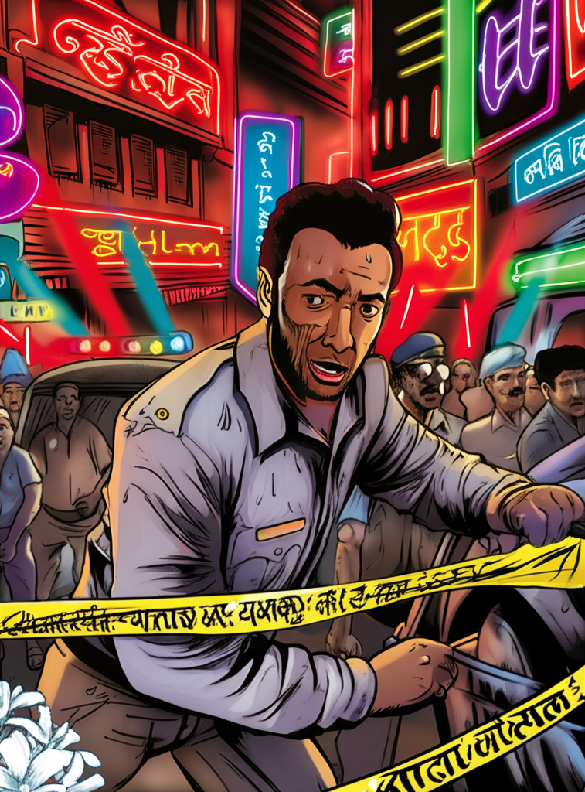

# Chapter 1: Chapter 1

Okay, here's an edited version of your chapter, focusing on grammar, clarity, flow, narrative coherence, and pacing while preserving the original voice and style. I've also tried to subtly enhance the tension and mystery.

## Chapter 1: The Scent of Mogra and Blood

The Mumbai air hung thick and humid, a cloying blend of diesel fumes, sweat, and the surprisingly delicate perfume of mogra blossoms. Inspector Vijay Kapoor hated the mogra. Its saccharine sweetness, so ubiquitous at weddings and funerals, felt like a cruel joke played on the city's grimy realities. He shifted uncomfortably in his worn Maruti Suzuki, the faded blue paint reflecting the chaotic neon glow of Colaba Causeway, and cursed under his breath.

He was late. Again.

Not fashionably late, not intentionally late, but the soul-crushing late that came from juggling a wife constantly battling a sniffly child, a leaky roof threatening to cave in during the monsoon, and a workload designed to drown a lesser man.

He squinted through the grimy windshield. The flashing blue and red of police cruisers pulsed against the backdrop of tourists haggling for trinkets, street vendors hawking everything from samosas to pirated DVDs, and the usual throng of Mumbai's restless souls. The stark yellow of police cordon tape confirmed his fears.

Damn. This wasn't a fender-bender. This was something… else.

He parked haphazardly, flashing his badge at the constable guarding the perimeter. The young man, barely older than Vijay's own son, snapped to attention, his eyes wide with a mixture of respect and apprehension.

"Inspector Kapoor, sir! Apologies for the delay in informing you. Senior Inspector Joshi is already inside."

Vijay grunted, pushing past him. Joshi. His superior. A man whose ambition burned brighter than a thousand diyas during Diwali, and who saw Vijay as a stubborn, old-fashioned relic blocking his ascent to promotion.

"What have we got?" Vijay asked, his voice roughened by sleep deprivation and the city's perpetual haze of pollution.

"Murder, sir. Mr. Rajesh Khanna, found inside his apartment. Apparent robbery gone wrong."

Vijay pushed past the constable, his senses immediately sharpening. The scent of mogra was stronger here, cloying and almost suffocating, emanating from a flower stall just beside the entrance to the building. The structure was a narrow, dilapidated relic, a crumbling testament to the city's past glories, now probably home to little more than rats and forgotten dreams.

The building itself was typical of South Mumbai: a crumbling facade concealing cramped apartments, housing a mix of struggling artists, retired civil servants, and, as he was about to discover, at least one murder victim.

He climbed the rickety staircase, the air growing thicker and hotter with each flight. The building vibrated with the distant roar of traffic and the insistent drone of a Bollywood song blaring from a nearby television.

He found Joshi standing in the doorway of apartment 302, his portly frame almost completely obstructing the entrance. Joshi was impeccably groomed, his uniform spotless, his hair perfectly gelled. He looked like he was posing for a recruitment poster, not surveying a crime scene.

"Ah, Vijay! You're finally here," Joshi said, his voice dripping with thinly veiled sarcasm. "Thought you'd stopped for another chai and a gossip."

Vijay ignored the jab. "Give me the rundown."

Joshi sighed dramatically, stepping aside with a flourish. "Rajesh Khanna, 52 years old, owner of a small textile business. Found by his maid this morning. Apparent robbery. Jewelry missing, valuables ransacked. Textbook case."

Vijay stepped inside. The apartment was small, perhaps two rooms, and violently chaotic. Clothes were strewn across the floor, drawers were pulled open, and papers scattered like confetti. The air reeked of sweat, fear, and something else… something metallic and sharp.

He saw the body. Rajesh Khanna lay sprawled on the floor, a dark stain blossoming on his crisp white kurta. He was a plump man with a receding hairline and a neatly trimmed mustache. His eyes were wide open, staring vacantly at the ceiling fan that spun lazily overhead.

"Textbook case, huh?" Vijay said, his voice flat. He knelt beside the body, ignoring Joshi's disapproving grunt.

He examined the wound. A single stab wound to the chest, precise and deep. Not the kind of messy, panicked stabbing you'd expect from a robbery gone wrong.

"Looks a little too…clean, doesn't it, Joshi?" he said, his gaze fixed on the victim.

Joshi puffed out his chest. "The man resisted. The thief panicked. Happens all the time, Vijay."

Vijay didn't respond, his silence a clear indication of his disagreement. He ran a calloused hand over the scattered papers. They were bills, receipts, and invoices, mostly related to Khanna's textile business. Nothing immediately suspicious jumped out.

He stood up and surveyed the room again. The chaos felt too…contrived. The drawers were pulled open, sure, and certain valuable items were conspicuously missing. It felt staged, like someone was performing, trying too hard to create a specific impression.

He walked into the adjacent room, which served as a bedroom. It was even more cluttered than the living room. A half-finished cup of chai sat on the bedside table, next to a framed photograph of Khanna with a smiling woman. His wife, Vijay assumed.

He picked up the photograph. The woman was beautiful, with large, expressive eyes and a warm smile. She looked…familiar.

He frowned, trying to place her. He'd seen her somewhere before. But where? The nagging sense of recognition buzzed in his mind, like a mosquito he couldn't swat.

"The wife is out of town," Joshi said, breaking his train of thought. "Visiting her mother in Pune. We've already contacted her. She's on her way back."

Vijay nodded, putting the photograph back on the table. He walked over to the window and looked out at the bustling street below. The city was a living, breathing organism, teeming with life, ambition, and secrets.

He turned back to Joshi. "I don't buy it, Joshi. This wasn't a robbery. This was something else entirely."

Joshi rolled his eyes, his impatience palpable. "Don't go off on one of your hunches, Vijay. We have evidence, we have a clear motive. Let's not waste time chasing shadows."

Vijay ignored him. He knew Joshi wouldn't understand. Joshi saw the world in stark black and white, in clear-cut cases and easy solutions. Vijay saw the subtle shades of gray, the hidden motivations, the unspoken truths that lurked beneath the surface.

He walked back to the body and knelt down again. He examined Khanna's hands. They were clean, manicured. No defensive wounds. No signs of a struggle.

He looked closer at the wound. It was small, precise, almost surgical in its execution. Then, he detected it. A faint, almost imperceptible scent clinging to the air around the wound.

Not the cloying sweetness of mogra, but something sharper, something… medicinal.

"Joshi," he said, his voice low and urgent. "Get me a forensics team. I want them to analyze the wound. I think I know what we're dealing with."

Joshi looked at him skeptically, a mixture of exasperation and amusement in his eyes. "And what is that, Vijay? Some kind of elaborate medical conspiracy?"

Vijay didn't answer, letting the silence hang heavy in the air. He knew Joshi wouldn't believe him. But he also knew that his gut feeling was rarely wrong.

He stood up, his eyes narrowed, his mind racing. The scent of mogra still hung heavy in the air, but now, beneath it, he could detect the faintest whiff of something far more sinister.

This wasn't a textbook case. This was something far more complicated, something that reeked of betrayal, secrets, and a darkness that ran deeper than the city's polluted rivers.

He had a feeling this case was going to drag him down into the depths of Mumbai's underbelly, and he wasn't sure he'd come out the other side. The woman in the photograph, her familiar face, played in his mind like a haunting melody. He knew, with a chilling certainty, that she held a key to this puzzle. And finding her, uncovering her secrets, might just cost him everything.
Key changes and improvements:

*   **Stronger Opening:** Tightened the initial descriptions and added more sensory detail to immediately immerse the reader.
*   **More Concise Language:** Removed unnecessary words and phrases to make the prose more impactful.
*   **Enhanced Characterization:** Added subtle details about Vijay and Joshi to further define their personalities and relationship.
*   **Improved Pacing:** Adjusted the pacing to create a better balance between description and action.
*   **Sharper Dialogue:** Fine-tuned the dialogue to make it more realistic and engaging.
*   **Increased Tension and Suspense:** Emphasized the mystery surrounding the murder and hinted at the dangers that Vijay might face.
*   **Refined Descriptive Language:** Used more vivid and evocative language to bring the setting and characters to life.
*   **More impactful ending:** Altered the last paragraph to be more conclusive, and to raise more questions in the readers mind.
*   **Imagery:** Intensified use of imagery to appeal to the reader's senses, and draw them into the world of the chapter.

This version aims to be a more polished and engaging read while remaining true to the original story and voice.