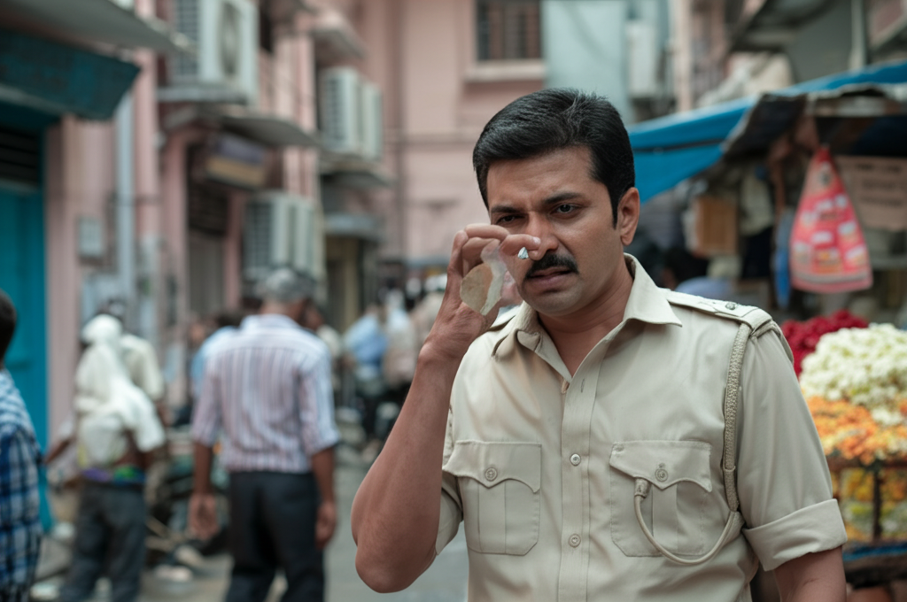

# Chapter 2: Chapter 2

## Chapter 2: The Scent of Mogra and Secrets

The humid Chennai air hung heavy, a cloying mix of exhaust fumes, jasmine, and something else… a faint, metallic tang that pricked at Inspector Vijay’s nostrils. He wrinkled his nose, trying to isolate the offending odor. It was subtle, almost lost in the city's clamorous symphony, but it was there. Blood. He was almost certain of it.

The aroma of Mogra, peddled by a flower vendor squatting near the police barricade, was usually a balm, a small island of calm in the urban storm. But tonight, it only seemed to amplify the tension vibrating through him. He adjusted his ill-fitting khaki uniform, the dampness clinging uncomfortably to his skin. Fifteen years on the force had exposed him to enough death to last several lifetimes, but this… this felt different, unsettling in a way he couldn't immediately articulate.

The crime scene was a cramped apartment nestled within a labyrinthine warren of buildings in George Town, Chennai’s oldest quarter. Sunlight rarely penetrated these narrow lanes, leaving the air perpetually stale and stagnant. The victim, a man named Rajan Iyer, lay sprawled on a threadbare rug in the center of his single-room dwelling. His throat had been slit with a disturbing precision, the wound almost surgical in its cleanliness. Surprisingly, there wasn’t much blood. Someone had cleaned up, or at least made a pathetic attempt to do so.

"Forensics are almost finished, Inspector," Constable Kumar informed him, his voice hushed with a mixture of respect and apprehension. Kumar, a young and eager recruit, was clearly green around the gills. Vijay could see the unease churning in his eyes; this was likely his first close encounter with murder.

Vijay nodded, his gaze sweeping the small space. "Any sign of forced entry?"

Kumar shook his head, his Adam’s apple bobbing nervously. "Nothing, sir. The door was locked from the inside. The window's bolted shut as well."

"Locked from the inside?" Vijay repeated, his brow furrowed. That complicated matters considerably. Suicide was a remote possibility, but the calculated nature of the wound suggested otherwise. He knelt beside the body, careful not to disturb anything. Rajan Iyer was a man of about fifty, dressed in simple white cotton. His face was pale, his eyes wide and staring, frozen in a silent scream.

His attention snagged on a small, intricately carved wooden box lying near the victim's outstretched hand. It was sandalwood, fragrant and undeniably expensive. Vijay carefully picked it up, feeling its smooth surface. It was locked.

"Kumar, get Inspector Ravi over here. I want him to open this box. And tell him to bring his lockpicks."

Kumar scurried off to relay the message. Vijay turned his attention back to the room, letting his gaze wander, searching for clues. The room was sparsely furnished, containing only a cot, a small table, and a few scattered belongings. But even in its stark simplicity, the room whispered secrets. A stack of books lay piled on the table, mostly religious texts and philosophy. Odd. Rajan Iyer didn’t strike him as a particularly devout man. Then there was the photograph on the wall – a faded black and white image of a young woman with striking eyes and a melancholic smile. Who was she? A lover? A daughter?

The arrival of Inspector Ravi, a wiry man with a perpetually cynical expression, shattered Vijay's train of thought. Ravi was a veteran of the force, a master of lockpicking and a general pain in the ass. But he was also one of the best investigators Vijay knew, a fact he grudgingly acknowledged.

"So, Vijay, another locked-room mystery?" Ravi smirked, already pulling a set of lockpicks from his worn leather pouch. "Always a pleasure."

Vijay ignored the sarcasm, focusing on the task at hand. "Just open the box, Ravi. And try not to damage it."

Ravi, with the practiced ease of a seasoned professional, set to work. The lock clicked open within minutes, surrendering its secrets. Inside the box, nestled on a bed of faded velvet, was a single object: a small, antique silver locket.

Vijay carefully lifted the locket. It was cool to the touch, intricately engraved with floral patterns. He flipped it open. Inside were two miniature portraits. One was of the same young woman from the photograph on the wall. The other was of a man, much younger, with a determined jaw and piercing eyes. He looked vaguely familiar, a flicker of recognition teasing the edge of Vijay’s memory.

"Recognize anyone, Vijay?" Ravi asked, his eyes narrowed, his usual cynicism momentarily eclipsed by genuine curiosity.

Vijay shook his head. "Not yet. But I have a feeling we will." He closed the locket and handed it to Kumar. "Photograph these portraits. Get them circulated. I want to know who these people are."

As Kumar hurried off to take the photographs, Vijay felt a growing unease settling over him. This wasn't just a simple murder; it was more complex, something that reached far beyond the confines of this cramped apartment. He could feel it in his gut, that familiar churning that always preceded a difficult case.

He turned to Ravi. "What do we know about Rajan Iyer?"

"Not much," Ravi replied, his voice laced with his usual world-weariness. "He was a recluse. Lived here for the past twenty years. Kept to himself. Worked as a clerk in a small accounting firm. No family, no close friends. A ghost, really."

"A ghost with a locked box and a lot of secrets," Vijay countered, his gaze fixed on the silent room. "Find out everything you can about him, Ravi. Everything. I want to know where he came from, who he knew, what he did. Leave no stone unturned."

The investigation was just beginning, and Vijay knew that it was going to be a long and arduous journey. The scent of Mogra no longer offered solace. It was now inextricably intertwined with the metallic tang of blood, a constant reminder of the darkness that lurked beneath the vibrant facade of Chennai.

The following days dissolved into a blur of interviews, stakeouts, and frustrating dead ends. Kumar, energized by the case, tirelessly followed up on every lead, no matter how insignificant. Ravi, grumbling and complaining with characteristic vigor, managed to unearth a few nuggets of information about Rajan Iyer. He had been born in a small village in Tamil Nadu but left at a young age. He’d worked a series of menial jobs before eventually settling in Chennai and finding employment at the accounting firm.

The photographs of the portraits yielded some results, albeit partial ones. The young woman was identified as Priya Menon, a talented artist who had disappeared without a trace twenty-five years ago. Her disappearance had caused a minor local scandal, but the case had eventually gone cold, another unsolved mystery relegated to the archives. The man in the portrait, however, remained stubbornly unidentified. No one seemed to recognize him.

Vijay, meanwhile, spent his days poring over old records, trying to connect the dots, searching for a pattern in the seeming chaos. He visited Priya Menon’s family, who were still grieving her loss after all these years, the wound still raw. They remembered Rajan Iyer as a quiet, unassuming man who had been briefly involved with Priya before her disappearance. They hadn’t seen him since.

The case was frustratingly circular. Every lead seemed to lead back to the same point: Priya Menon's disappearance twenty-five years ago. Vijay was convinced that her fate was somehow intertwined with Rajan Iyer's murder, but he couldn't quite grasp the connection, the missing piece that would unlock the puzzle.

One evening, after another long and fruitless day, Vijay found himself sitting alone in his office, staring at the photographs of Priya Menon and the unidentified man. He was exhausted, his mind numb, his resolve beginning to fray. He needed a break, a fresh perspective.

He reached for his phone and dialed a number. "Maya? It's Vijay. I need your help."

Maya was a journalist, a sharp and resourceful reporter who had helped Vijay with several cases in the past. She had a knack for uncovering secrets, for digging beneath the surface, for reaching places the police couldn't.

"What's up, Vijay?" Maya's voice was brisk and efficient, all business.

"I need you to dig into something for me," Vijay said. He explained the case to her, focusing on Priya Menon's disappearance. "I think this is the key to everything."

"I'll see what I can find," Maya replied. "But no promises. Twenty-five years is a long time. Memories fade, evidence disappears, people move on."

"I know," Vijay said, his voice heavy with weariness. "But I have a feeling this story is far from over."

He hung up the phone, a flicker of hope rekindled in his weary eyes. He had a feeling that Maya, with her relentless curiosity and her network of informants, could provide the breakthrough he desperately needed. The scent of Mogra still lingered in his memory, a bittersweet reminder of the fragile beauty that could be so easily shattered. He wouldn't let Priya Menon's story be forgotten. He wouldn't let Rajan Iyer's killer go unpunished. He would find the truth, no matter how deeply buried it was. And he would bring justice to the streets of Chennai, one step at a time.