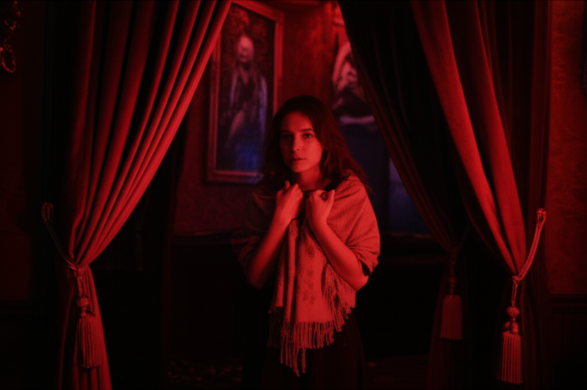

# Chapter 1: Chapter 1

## Chapter 1: Crimson Lace

The air inside the Velvet Veil reeked of sin. Not the fire-and-brimstone kind, but the kind that clung to your skin like cheap perfume – a sweet, sickly scent of desperation and unspoken desires. Amelia adjusted the thin shawl around her shoulders, the silk offering scant protection from the chill that settled deep in her bones. It wasn't just the draft snaking through the neglected gothic architecture; something else entirely, palpable and heavy, settled with the dust motes dancing in the dim, crimson-filtered light.

Even in Prague, a city steeped in its peculiar blend of history, folklore, and shadowed indulgence, the Velvet Veil was notorious. Whispers of the private club, traded in hushed tones in back alleys and smoky corners of the Old Town, spoke of secrets as currency and blurred boundaries, like watercolour paint in the rain. Amelia was here for a story, a dark, glittering tale that she hoped would catapult her from writing fluff pieces for travel magazines to something more... something real.

She’d secured an invitation through a contact, a journalist friend who owed her a considerable favour – a debt she was beginning to think wasn’t worth the price of her discomfort. The club was everything she’d imagined, and worse. Heavy velvet drapes, the colour of dried blood, cloaked the walls, which were adorned with unsettling artwork – paintings of distorted figures engaged in acts that churned Amelia’s stomach. Chandeliers, crafted from blackened silver and dripping with red crystals, cast an eerie glow on the patrons, their faces masked by shadows and secrets.

A mournful violin concerto, punctuated by a throbbing bass that resonated deep within her chest, amplified the unsettling atmosphere. Amelia nursed a glass of wine, the cloying sweetness doing little to soothe her nerves. She felt like an imposter, a moth fluttering too close to a flame.

---

Then, he appeared.

He didn't simply walk into the room; he materialized from the very shadows clinging to the walls. One moment the space was empty, the next, he was there, a stark figure against the crimson backdrop.

Tall, impossibly so, he commanded the room with a presence Amelia had never witnessed. He moved with a predatory grace, his eyes, the colour of storm clouds gathering over the sea, scanning the room with an intensity that made her shiver. A tailored suit, dark as midnight, molded to his lean frame, emphasizing the sharp angles of his jaw and the dangerous set of his shoulders.

He was beautiful, devastatingly so, in a way that bordered on cruel. The kind of beautiful that was both alluring and terrifying, like a perfectly sculpted gargoyle perched atop a crumbling cathedral.

Amelia felt a pull, a magnetic force that drew her gaze, even as her instincts screamed at her to look away, to flee. He paused, his eyes meeting hers across the crowded room. For a breathless moment, the music seemed to fade, the chatter died down, and it was just them, locked in a silent, invisible thread.

He raised a hand, beckoning her with a slow, deliberate gesture that sent a jolt of electricity through her veins. It wasn't an invitation; it was a command.

Swallowing hard, Amelia found herself rising to her feet, her legs feeling strangely unsteady. A strange sense of inevitability guided her as she navigated the throng of bodies.

Drawing closer, she could see the details she'd missed from afar: a thin scar, barely visible, bisecting his left eyebrow, and the subtle twitch in his jaw that suggested a carefully concealed tension. And his eyes... his eyes held a depth of sadness, a haunting melancholy that both intrigued and unsettled her.

He offered a small, almost imperceptible smile as she reached him. It didn't reach his eyes.

*You're the writer,* he said, his voice a low, resonant rumble that sent a shiver down her spine. *Amelia Moreau, I presume?*

Her name, spoken in his voice, felt strangely intimate, like a secret shared in the darkness. *Yes,* she managed, her voice barely audible above the music. *And you are…?*

*They call me Lucian,* he replied, his eyes never leaving hers. *Lucian Thorne.*

Lucian Thorne. The name tasted like forbidden fruit on her tongue. It suited him. Dark, dangerous, and utterly captivating.

---

He gestured towards a secluded booth, tucked away in a shadowy corner of the club. *Join me,* he said. *I believe we have much to discuss.*

Amelia hesitated for only a moment. This was it. The story she’d been chasing. The dark, glittering story that could change everything.

She followed him to the booth, the velvet curtains closing around them like a suffocating embrace. The world outside faded away, leaving them enveloped in a cocoon of shadows and unspoken desires.

Lucian settled into the booth, his movements fluid and graceful. He poured her another glass of wine, the crimson liquid swirling like blood.

*So, Miss Moreau,* he began, amusement lacing his voice. *Tell me, what brings a writer like you to a place like this?*

Amelia took a sip of the wine, trying to steady her nerves. *I'm here to write a story,* she said, meeting his gaze head-on. *About the Velvet Veil. About the people who frequent it.*

Lucian chuckled, a low, throaty sound that vibrated in the confined space. *And what do you hope to find here, Miss Moreau? What kind of story are you looking for?*

*The truth,* Amelia replied, her voice firm. *The truth behind the masks. The truth behind the secrets.*

Lucian leaned back, his eyes narrowing slightly. *The truth,* he repeated, as if testing the word on his tongue. *A dangerous commodity, wouldn't you agree?*

*Sometimes,* Amelia conceded. *But it's also the only thing that matters.*

A slow smile spread across Lucian's face, this time reaching his eyes. It didn't reassure her, but rather sent a jolt of apprehension through her.

*Very well, Miss Moreau,* he said. *I will tell you a story. A story you will never forget.*

He paused, taking a deep breath, as if gathering the threads of a long-forgotten memory.

*It's a story about love,* he began, his voice dropping to a near whisper. *And loss. And the darkness that lies hidden within the human heart.*

He leaned closer, his breath warm against her ear.

*But be warned, Miss Moreau,* he murmured. *Once you hear this story, you can never unhear it. Once you see the darkness, you can never unsee it. Are you sure you're ready for the truth?*

Amelia met his gaze, her heart pounding in her chest. She knew she was playing with fire, venturing into dangerous territory. But she couldn't turn back now.

*Yes,* she said, her voice trembling slightly. *I'm ready.*

Lucian Thorne smiled, a predatory glint in his eyes.

*Then let the story begin,* he said, his voice a silken promise in the darkness.

---

He took another sip of his wine, his eyes fixed on hers, and began to speak. He told a story of passion and betrayal, of obsession and revenge, a story so dark and twisted that it made Amelia's blood run cold. He spoke of a love that consumed everything in its path, leaving only ashes and ruin in its wake. He spoke of secrets buried deep, secrets that would shatter the foundations of everything she thought she knew.

As he spoke, Amelia found herself drawn deeper and deeper into his world, a world of shadows and secrets, where nothing was as it seemed. She felt a strange, unsettling connection to Lucian, a bond forged in the darkness. She knew, with a certainty that chilled her to the bone, that this story was not just a story; it was a confession, a warning, and perhaps even a seduction.

He finished his tale, the silence hanging heavy in the air. Amelia found herself breathless, her mind reeling from the revelations.

*So, Miss Moreau,* Lucian said, his voice soft but intense. *What do you think? Is this the story you were looking for?*

Amelia looked at him, her eyes searching his. She didn't know what to think, what to believe. All she knew was that she was in **too deep**.

*I don't know,* she said, her voice barely a whisper. *I need time to process.*

Lucian nodded slowly, his eyes never leaving hers. *Take all the time you need,* he said. *But be warned, Miss Moreau. Time is a precious commodity. And in this world, it has a habit of running out.*

He stood up, his movements fluid and graceful. *I must take my leave,* he said. *But I have a feeling we will meet again, Miss Moreau. Very soon.*

He turned and walked away, disappearing into the throng of bodies, leaving Amelia alone in the booth, enveloped in the darkness and the lingering scent of his cologne – a dark and intoxicating blend of sandalwood and something else… something indefinable, something dangerous.

Amelia sat there for a long time, staring into the swirling crimson liquid in her glass, trying to make sense of what she had just heard. The music seemed louder now, the chatter of the other patrons more insistent. She felt a sense of unease, a premonition that something terrible was about to happen.

A growing certainty told her she had stumbled into something far more dangerous than she could have ever imagined. And she knew, despite the fear that gripped her heart, that she couldn't turn back now.

The story had begun, and she was already **trapped within its pages.**