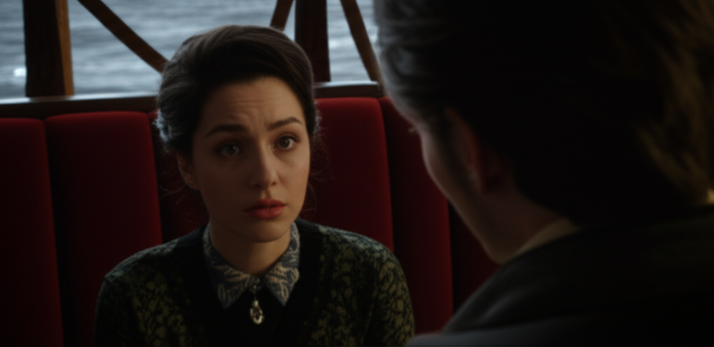

# Chapter 2: Chapter 2

## Chapter 2

The air in the Velvet Curtain was thick enough to taste, a cloying perfume battling stale cigarette smoke, with an undercurrent of something else… metallic and sharp, that clung to the back of Isobel’s throat. The scent both repelled and intrigued her, mirroring her feelings toward the man who had brought her here.

Lucien. The name alone hummed with a dark energy that resonated deep within her. Across the plush, crimson booth, the dim light sculpted his features into stark angles. His eyes, the color of a stormy sea, held depths Isobel couldn't fathom. Last night, at the charity gala, they had locked onto hers, and she'd felt a magnetic pull, a sense of inevitability that had overridden her carefully constructed logic.

He was dangerous. She knew it instinctively. Whispers amongst the city's elite preceded him, painting a portrait of a ruthless businessman, a reclusive philanthropist, with rumored connections to… things. Things Isobel preferred not to dwell on. Yet, here she was, drawn in like a moth to a flame, willingly stepping into the shadows he inhabited.

*“You’re quiet, Isobel,”* Lucien said, his voice a low rumble that seemed to vibrate through her bones. He swirled the amber liquid in his glass, the ice clinking softly against the crystal. *“I thought you’d have more questions. Most women do.”*

Isobel raised her chin, forcing herself to meet his gaze. *“I prefer to observe first.”*

A chuckle, devoid of humor, escaped him. *“A wise approach. But observation only gets you so far. Sometimes, you have to… experience.”* He leaned forward, the subtle scent of sandalwood, laced with something darker, more primal, reaching her. *“Don't you agree?”*

Isobel’s heart hammered against her ribs. She’d spent her life meticulously constructing a wall around herself, brick by brick, to protect herself from the world and, more importantly, from herself. Lucien, with his mere presence, threatened to dismantle it entirely.

*“Experience can be… overrated,”* she managed, her voice betraying a tremor she desperately tried to conceal.

He smiled, a slow, predatory curve of his lips. *“Perhaps. But some experiences are… unforgettable. Tell me, Isobel, what do you find unforgettable?”*

She averted her gaze, focusing on the jazz band playing softly in the corner. The mournful saxophone solo echoed the turmoil within her. Unforgettable? Her life had been a carefully curated tapestry of beige, devoid of passion or excitement. Until now.

*“I… I haven’t had much experience with the ‘unforgettable’,”* she admitted, the words tasting like ash.

Lucien’s smile widened, and Isobel felt a shiver crawl down her spine. He knew. He knew she was a blank canvas, waiting to be painted. And he, she suspected, intended to be the artist.

*“Then allow me,”* he said, his voice a silken caress. *“Allow me to introduce you.”*

---

He gestured to a waiter who moved with unnerving quietness, and whispered something in his ear. The waiter disappeared, returning moments later with a small, silver tray. On it sat a single, perfect rose, its petals the deepest shade of crimson, almost black.

*“A black baccara,”* Lucien explained, picking it up and twirling it between his fingers. *“They say it represents rebirth, new beginnings. And, in some cultures, obsessive love.”*

He offered the rose to Isobel, his eyes holding hers captive. *“A gift. A promise of things to come.”*

Isobel hesitated, her fingers trembling as she reached for it. The velvety petals felt strangely cool against her skin. *"*Thank you,*"* she whispered, her voice barely audible.

*"*You're welcome,*"* he said, his gaze intense. *"*But this is just the beginning, Isobel. A taste of what I have to offer.*"*

He leaned back in the booth, a self-assured smirk playing on his lips. *"*Tell me about yourself, Isobel. Tell me about the woman hidden beneath the prim dresses and polite smiles.*"*

Isobel swallowed hard. Where to begin? Her life was a carefully constructed facade, designed to hide the broken pieces of her past.

*"*There's not much to tell,*"* she said, trying to sound nonchalant. *"*I work for my father's company. I volunteer at the local animal shelter. I lead a very ordinary life.*"*

Lucien raised an eyebrow, clearly unconvinced. *"*Ordinary? I don't believe it. Everyone has secrets, Isobel. Buried desires. Things they crave but are too afraid to admit.*"*

His words hit a raw nerve. He was right. She craved… something. She just didn't know what it was. Or, perhaps, she was afraid to acknowledge it – the darkness that lurked within her, a darkness that resonated with Lucien's shadows.

*"*Perhaps,*"* she conceded, clutching the rose tightly.

---

*"*Tell me about your father,*"* Lucien pressed, his eyes never leaving hers.

Isobel stiffened. Her relationship with her father was… complicated. He was a powerful man, used to getting his way, who had always controlled her, molding her into the perfect daughter, the perfect heiress.

*"*He's… a good man,*"* she said, the words sounding hollow. *"*He's built a successful company. He's provided for me.*"*

*"*But?*"* Lucien prompted, amusement lacing his voice.

Isobel hesitated. *"*But… he expects a lot from me. He has certain expectations for my future.*"*

*"*Marriage, I presume?*"* Lucien asked, swirling his drink.

Isobel nodded. Her father had been subtly hinting at potential suitors for years – wealthy, influential men who would solidify his position in society, men who would never see the darkness within her.

*"*He wants me to marry well,*"* she said, bitterness creeping into her voice, *"*to secure the family legacy.*"*

Lucien’s eyes darkened. *"*And what do you want, Isobel? What does your heart desire?*"*

The question hung in the air, heavy with unspoken possibilities. Isobel didn't know. She had never allowed herself to consider it, always living her life according to others' expectations.

But looking at Lucien, feeling the pull of his dark charisma, she glimpsed a different path – dangerous, unpredictable, and utterly intoxicating.

*"*I… I don't know,*"* she admitted, her voice barely a whisper.

Lucien leaned closer, his breath warm against her ear. *"*Then let me show you.*"*

He reached out and gently took her hand, his touch sending a jolt of electricity through her. His fingers intertwined with hers, his grip firm and possessive.

---

*"*Come with me, Isobel,*"* he whispered. *"*Let me introduce you to the shadows. Let me show you what it feels like to truly live.*"*

Isobel’s mind screamed at her to run, to escape before she was completely consumed. But her body remained rooted to the spot, drawn to him by an irresistible force.

*"*Where… where are we going?*"* she asked, her voice trembling.

Lucien smiled, a flicker of something dangerous in his eyes. *"*Somewhere you've never been before. Somewhere you'll never forget."*

He stood, pulling her with him. Isobel followed, moving as if in a trance. She was no longer in control, having surrendered to the darkness, to Lucien's allure.

As they walked out of the Velvet Curtain, into the cool night air, Isobel knew her life would never be the same. She had crossed a line, a point of no return, entering a world of shadows and secrets, where pleasure and pain were intertwined, and Lucien reigned supreme.

**The black baccara rose, clutched tightly in her hand, was a promise of the darkness to come.** And despite the fear, Isobel couldn't help but feel a thrill of anticipation. The ordinary life she had always known was fading away, replaced by something extraordinary, dangerous, undeniably alluring.