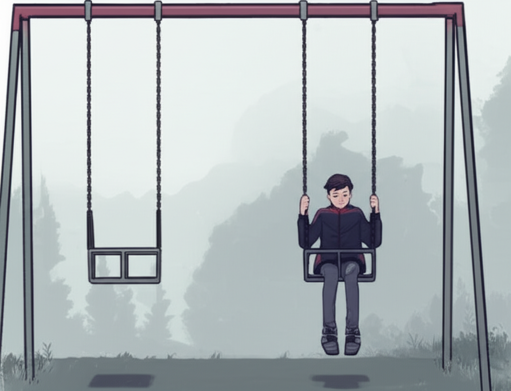

# Chapter 1: Chapter 1

## Chapter 1: The Echo in the Empty Swing

The air in the park hung thick with the promise of a summer that never quite arrived. Mid-June, and a persistent, bone-chilling dampness clung to everything, making the painted metal of the swings cold and unforgiving against Leo’s hands. He pushed himself listlessly, the chain groaning in protest, a sound that echoed the emptiness taking root inside him.

He was supposed to be here with Maya.

Every Tuesday, rain or shine, they met at this park. Maya, with her riot of auburn curls perpetually escaping her ponytail and her eyes – the color of warm honey – that seemed to see right through him. They’d sit on the bench, sharing a bag of slightly stale potato chips, arguing playfully about the merits of Tolkien versus Pratchett, or dreaming up elaborate plans for a future filled with travel and questionable career choices.

But Maya wasn’t here.

And she hadn’t been here for three Tuesdays.

Leo kicked the ground with the toe of his worn Converse, sending a small spray of gravel scattering across the damp asphalt. He knew he should call her. He knew he should just pick up the phone and demand an explanation, demand to know why she had vanished, why she was ignoring his texts, his calls, his… everything.

But fear, cold and paralyzing, kept him rooted to the swing. He imagined her on the other end of the line, her voice laced with a coolness he had never heard before, uttering words that would shatter the carefully constructed world they had built together. He couldn't risk it. Not yet.

He looked around the park. A young mother chased after a toddler with a bright red balloon, their laughter a sharp, discordant note in the silence surrounding him. An elderly man sat on a bench, reading a newspaper, oblivious to the weight of the clouds pressing down on the city. A group of teenagers huddled near the basketball court, their voices a low murmur punctuated by the rhythmic bounce of a ball. Life, oblivious and indifferent, continued without him.

---

He’d known Maya since kindergarten, where she had bravely defended him from a particularly aggressive paper mache dinosaur. He’d been a shy, bookish child, lost in his own world of fantasy and adventure. Maya, vibrant and fearless, had dragged him out of his shell, showing him the joys of climbing trees, building forts, and getting into just the right amount of mischief.

Their friendship had been a constant, a comforting presence in a world that often felt overwhelming. He hadn't even realized when that friendship had subtly, almost imperceptibly, deepened into something more. He'd looked at her one day and suddenly seen her not just as his friend, but as... Maya.

He’d told her. Just three months ago, under the flickering fairy lights of the city park during the annual summer festival. He remembered the way the light had caught in her hair, making her look almost ethereal, the way her eyes had widened in surprise, then softened with something that mirrored his own feelings.

*"I… I love you, Maya,"* he'd stammered, the words tumbling out in a rush of nervous energy.

She hadn't said it back. Not immediately. She had taken his hand, her touch sending a jolt of electricity through him. *"*Leo,"* she'd said, her voice soft, *“I… I care about you so much. You’re my best friend.*"*

He’d almost deflated right there, the weight of rejection threatening to crush him. But then she’d squeezed his hand tighter and continued, *"*And maybe… maybe it could be something more. I just… I need time to figure things out.*"*

He’d understood. Or at least, he’d thought he had. He’d given her the time she needed, careful not to push, respecting her space. And slowly, gradually, she’d seemed to open up, to lean into the burgeoning feelings blossoming between them. They had spent the last few months exploring this new terrain, navigating the delicate dance of friendship and something more.

And then, silence.

---

He pushed harder on the swing, the chains rattling with renewed vigor. He had to know what was happening. He couldn't keep living in this limbo, this agonizing uncertainty.

He pulled out his phone, his fingers trembling slightly as he scrolled through his contacts. He found her name, *"*Maya Sunshine,*"* the nickname he’d given her years ago because she was, quite simply, his sunshine. He hovered his thumb over the call button, hesitating.

He scrolled down to her address, memorized from countless times of walking her home after their park dates. He knew where she lived. He could just… go there.

The thought settled on him, a sudden, urgent impulse. He couldn’t wait any longer. He had to see her. He had to know.

He shoved his phone back into his pocket, hopped off the swing, and started walking. The park, usually a place of solace and joy, felt oppressive, a cage that held him captive in its memories. He broke into a run, his breath coming in ragged gasps, his heart pounding in his chest like a trapped bird.

He knew her house well. A small, two-story Victorian with a peeling paint job and a vibrant garden overflowing with flowers of every color imaginable. It was a reflection of Maya herself—a little bit quirky, a little bit chaotic, but undeniably beautiful.

He paused on the sidewalk, taking a deep breath to steady himself. He could hear the faint strains of music coming from inside the house, something classical, a piece he didn’t recognize. He walked up the path, his steps slow and deliberate, each one a small act of defiance against the fear threatening to consume him.

He reached the front porch and hesitated again. The doorbell seemed a monumental obstacle, a barrier between him and the truth. He reached out, his finger hovering just above the button, when the door suddenly swung open.

Standing in the doorway was a woman he didn’t recognize. She was older, maybe in her late forties, with kind eyes and a warm smile. But it wasn't Maya.

*"Can I help you?"* she asked, her voice gentle.

Leo swallowed hard, his throat suddenly dry. *"*I… I’m looking for Maya,"* he stammered.

The woman's smile faltered slightly. *"*Maya's not here,*"* she said, her voice laced with a subtle sadness.

*"*Not here?"* Leo repeated, his voice barely a whisper. *"*But… she always lives here.*"*

The woman hesitated again, as if searching for the right words. *"*Maya… Maya moved,"* she said finally. *"*She moved about three weeks ago.*"*

**Leo felt the ground shift beneath his feet.** He gripped the railing of the porch, struggling to maintain his balance. *"*Moved? Where did she move to?"*

The woman sighed. *"*She didn't say. She just… left.*"*

**Left.**

The word echoed in his mind, a hollow, empty sound resonating with the ache in his heart. She had left without a word, without a goodbye. She had left *him*.

*"I… I'm sorry,"* the woman said, her voice filled with genuine sympathy. *"*Are you a friend of hers?*"*

Leo nodded dumbly, unable to speak.

*"*She… she didn't leave a forwarding address,"* the woman continued. *"*I'm her Aunt Clara. I just came by to clean up a little.*"*

Aunt Clara. He’d heard Maya mention her a few times, always with a fond smile. He desperately wanted to ask her more, to pry for any clue, any hint of where Maya had gone, but the words wouldn't come.

He just stood there, numb, staring at the closed door, the silence amplifying the ringing in his ears. The music inside the house had stopped.

Finally, he managed to croak out, *"*Thank you."*

He turned and walked away, his steps heavy and unsteady. The park seemed even darker now, the swing set a silent monument to a love vanished without a trace. The echo of Maya’s laughter, once a source of joy, now a painful reminder of what he had lost.

---

He walked aimlessly, lost in a sea of confusion and despair. Where had she gone? Why had she left? Had their connection been a mirage, a figment of his imagination? Had he misinterpreted everything?

He reached the riverbank, the familiar scent of the water a small comfort in the face of his devastation. He sat down on a bench, watching the water flow by, a relentless current carrying everything in its path. He felt like he was being swept away, lost in the undertow of Maya’s absence.

He pulled out his phone again, his fingers trembling as he typed a message. He’d send it, and then he’d put it away. It would be the last message he sent, he promised himself, until she reached out.

He typed:

“Maya, I don’t understand. Please, just tell me what happened. I love you.”

He stared at the message for a long moment, then pressed send. The screen went blank, the silence amplifying the deafening roar in his head.

He closed his eyes, and for the first time since Maya had disappeared, he allowed himself to cry. The tears streamed down his face, hot and bitter, a testament to the love he had lost, the future that had been stolen, and the lingering echo of her name – whispered on the wind. **The future remained a question he was afraid to face.**
