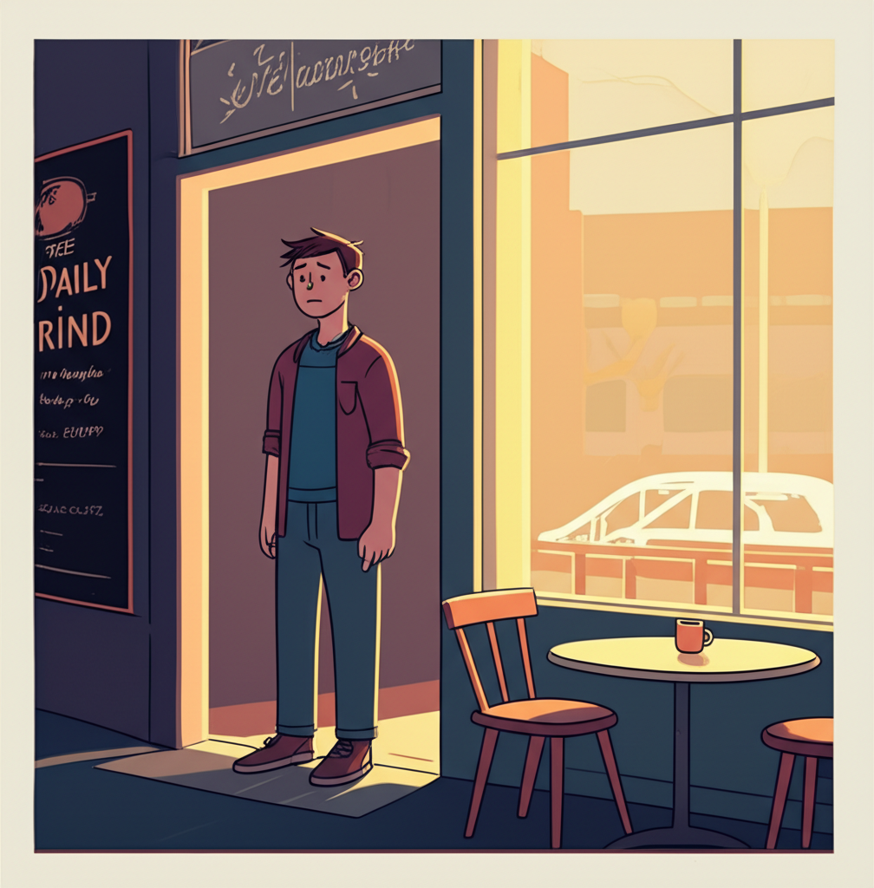

# Chapter 2: Chapter 2

## Chapter 2: Echoes in the Coffee Shop

The scent of roasted coffee beans hung heavy in the air, a familiar and comforting blanket amidst the chaotic symphony of *"The Daily Grind."* This wasn't just any coffee shop; it was *their* coffee shop. Or, at least, it had been. Now, stepping through the doorway felt like stepping into a ghost of happier times.

Liam swallowed, the lump in his throat refusing to budge. He hadn't been back here since... well, since Maya left. Six weeks, three days, and seventeen hours. He knew, because he'd counted them. Each agonizing second.

He scanned the familiar space. The worn, mismatched armchairs huddled in corners, whispering secrets in faded floral patterns. The chalkboard menu, scribbled with daily specials in a font that looked suspiciously like Maya’s whimsical handwriting. The soft, warm glow of Edison bulbs casting long shadows on the brick walls.

It was all exactly as he remembered, yet utterly, painfully different. An absence had settled over everything, a layer of dust on memories he longed to touch.

He spotted their usual table, the one by the window overlooking Elm Street. Sunlight streamed through the glass, illuminating the empty chairs like a stage waiting for its actors. He gripped the worn strap of his messenger bag tighter, fighting the urge to turn and flee.

*“Liam?”*

The voice was soft, tentative. He turned to see Chloe, the barista, leaning over the counter, her brow furrowed with concern. Chloe had been a constant fixture at The Daily Grind, a silent observer to his and Maya’s blossoming romance.

“Hey, Chloe,” he managed, his voice raspy from disuse.

*“Wow, long time no see,”* she said, her eyes searching his. *“You okay?”*

He forced a weak smile. *“Just... getting coffee. What else?”*

Chloe didn't look convinced. *“The usual?”*

He nodded. *"*Large Americano. Black.*"*

As she turned to prepare his drink, he risked another glance at the empty table. He could almost see her there, a strand of her messy bun escaping, her nose buried in a book, a half-eaten blueberry muffin perched precariously on the edge of the table. He could almost hear her infectious laughter bubbling up from the pages, threatening to spill into the quiet cafe.

The smell of brewing coffee was almost overwhelming, a pungent reminder of countless mornings spent sharing dreams and anxieties over steaming mugs. He remembered how she'd always sneak an extra sugar packet into his drink, even though he protested. *“You deserve a little sweetness,”* she'd say, her eyes twinkling with mischief.

Chloe placed the Americano on the counter. *“On the house,”* she said quietly.

He met her gaze, gratitude flooding through him. *"*Thanks, Chloe."*

He took the coffee and walked hesitantly toward the window table. He didn't sit. He couldn't bring himself to do so. He simply stood there, the warmth of the mug seeping into his cold hands, the silence of the empty space amplifying the deafening roar of his own grief.

He closed his eyes, trying to conjure her image, to recapture the feeling of her presence. But all he could see was the empty table, a stark and painful reminder of her absence, a void that seemed to stretch out and swallow the light.

---

Suddenly, a voice broke through his reverie.

*“Excuse me, is this seat taken?”*

Liam opened his eyes and turned to see a young woman standing beside him, a worn leather satchel slung over her shoulder. She had kind eyes and a hesitant smile.

*“Uh, no,”* he stammered, surprised. *“No, it's not.”*

She nodded and carefully lowered herself into one of the chairs. She pulled out a notebook and a pen and began to write, seemingly oblivious to his presence.

Liam took a slow sip of his coffee, trying to regain his composure. He considered leaving, but something held him back. He felt a strange pull, a shared resonance in the quiet solitude of the space.

He cleared his throat. “Sorry,” he said, *“I didn't mean to intrude. I was just… remembering someone.”*

The woman looked up from her notebook, her expression softening. *“I understand,”* she said. *“This place has that effect on people.”*

*“You come here often?”*

She smiled. *“More than I probably should. It's my writing sanctuary.”*

*“I used to come here all the time,”* Liam said, the words tumbling out before he could stop them. *“With… with my girlfriend.”*

The woman nodded sympathetically. *“Used to?”*

He hesitated, the pain still raw and sharp. *“She… she moved. Across the country.”*

*“That's tough.”*

He nodded, taking another sip of his coffee. *“Yeah,”* he said softly. *“It is.”*

They fell into a comfortable silence, punctuated only by the gentle hum of the coffee machine and the rustling of pages. He watched the woman as she wrote, her brow furrowed in concentration, her pen flying across the page. He wondered what she was writing, what worlds she was building with her words.

After a few minutes, she closed her notebook and sighed, stretching her arms above her head. *“Okay,”* she said, *“back to reality.”* She looked at him, her eyes questioning. *“I'm Sarah, by the way.”*

*“Liam,”* he replied, extending his hand.

They shook hands, a brief but meaningful connection forged in the shared space.

*“So, Liam,”* Sarah said, leaning back in her chair. *“Want to tell me about this girlfriend who moved across the country?”*

---

He hesitated, unsure whether he was ready to open up to a stranger. But there was something about Sarah, a genuine warmth and disarming honesty that lowered his defenses.

He took a deep breath. *“Her name is Maya,”* he began. *“And… it's complicated.”*

He told Sarah about Maya, about their whirlwind romance, about their shared love of books and movies and late-night conversations that stretched into early morning. He told her about their dreams of opening their own bookstore, a haven for fellow book lovers, filled with the comforting scent of old paper and the quiet murmur of turning pages. He told her about the arguments, the insecurities, the creeping doubts that had slowly chipped away at their foundation. And finally, he told her about the job offer in California, the opportunity she couldn't refuse, the one that had ultimately driven a wedge between them.

As he spoke, he felt a weight lifting from his shoulders, the burden of unspoken grief finally finding release. He hadn't talked about Maya to anyone, not really. He had bottled everything up, afraid of the pain, afraid of judgment. But talking to Sarah, a complete stranger, felt strangely liberating, like uncorking a bottle that had been fermenting for too long.

*“She said she needed to find herself,”* he finished, his voice cracking. *“She said she needed to figure out who she was without me.”*

Sarah was silent for a moment, her expression thoughtful. *“Sometimes,”* she said softly, *“the hardest thing to do is let someone go, even if it's for their own good. Sometimes love isn't enough.”*

He nodded, the truth of her words sinking in like a stone in water. He had known, deep down, that Maya needed to go, needed to spread her wings and fly. But that didn't make the absence any less painful, the void she left behind any less vast.

*“Did you love her?”* Sarah asked, her voice gentle.

The question hung in the air, heavy with unspoken emotion, a truth he couldn't deny. He didn't hesitate.

*“More than anything,”* he said, his voice barely a whisper. *“I still do.”*

Sarah smiled sadly. *“Then you'll always have that. Even if she's not here. Love changes us, shapes us. It's never truly gone.”*

They sat in silence for a while, the weight of his unspoken feelings permeating the space between them. He felt a strange mix of sadness and relief, a cathartic release of pent-up emotions that left him both exhausted and strangely lighter.

Finally, Sarah broke the silence. *“So, what are you going to do now, Liam?”*

He shrugged. *“I don't know,”* he admitted. *“I haven't really thought about it. Everything just feels… uncertain.”*

*“Maybe,”* Sarah said, her eyes twinkling with a hint of amusement, *“you should start by finishing that Americano.”*

He smiled, a genuine smile this time, the first one in weeks that didn't feel forced. He raised his mug and took a long, slow sip. The bitter coffee tasted… almost hopeful.

*“Maybe you're right,”* he said. *“Maybe I should.”*

---

As he finished his coffee, he looked out the window at Elm Street, no longer seeing only the ghosts of happier times. He saw the sunlight filtering through the trees, the people hurrying by, the vibrant life that continued to unfold, even in the absence of Maya.

He knew that he would never forget her. She would always be a part of him, a cherished memory etched into his heart. But he also knew that he couldn't dwell in the past, trapped in the amber of what used to be. He had to move forward, to find his own path, to create his own future, even if it looked drastically different than the one he had imagined.

He looked at Sarah, who was packing up her things, a small smile playing on her lips. He didn't know what the future held, but he knew that he wasn't entirely alone. He had friends, family, and even the possibility of new connections, new friendships to forge.

He stood up, feeling a fragile but undeniable sense of hope.

*“Thanks, Sarah,”* he said. *“For listening.”*

*“Anytime, Liam,”* she replied. *“And good luck. Write your own story.”*

He watched her walk away, her leather satchel bouncing against her hip. He took a deep breath, the scent of coffee no longer a haunting reminder of pain, but a subtle promise of new beginnings, a quiet invitation to step back into the world.

He turned and walked out of The Daily Grind, leaving the echoes of Maya behind him, not erasing them, but accepting them as a part of his past. He didn't know where he was going, but he knew that he was moving forward, one tentative step at a time. **And that, for now, was enough.**

The city stretched before him, a tapestry of possibilities, both daunting and exhilarating. He had a life to rebuild, a future to create, and while the path ahead was uncertain, it was his to navigate. And for the first time in a long time, he felt a flicker of hope, a tiny spark of light in the darkness. The journey wouldn't be easy, but he knew that he could face it, one breath at a time, one day at a time. The memory of Maya would always be with him, a bittersweet reminder of the love he had known and the future they had lost. But he was ready to embrace the present, to learn from the past, and to find his own happiness in the days to come. The coffee shop, once a symbol of heartbreak, now represented a turning point, a reminder that even in the darkest of times, there is always the possibility of a new dawn, a new chapter waiting to be written. He was ready to face it, ready to live. He loved you, Maya. And he would carry that love with him, always, not as a weight, but as a reminder of the capacity of his heart.
