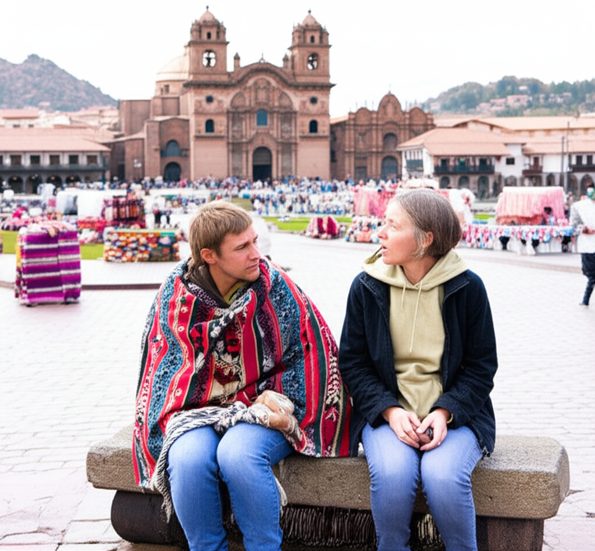

# Chapter 3: Chapter 3

## Chapter 3

The air in Cusco was thin, a biting chill that cut through even the layers of wool Elias had insisted Maya pack. Elias himself, swaddled in a vibrant Peruvian poncho he’d purchased with an unsettling amount of haggling enthusiasm, seemed immune to the altitude. Maya, however, felt perpetually short of breath.

They sat perched on a weathered stone bench overlooking the Plaza de Armas, the beating heart of the ancient Inca capital. The square pulsed with a kaleidoscope of sights and sounds – hawkers calling out with offers of woven goods, the lilting melodies of panpipes weaving through the air, the hushed reverence emanating from the magnificent Cusco Cathedral, a stone giant dominating one side of the plaza. It was exactly the scene Maya had envisioned, and yet, a persistent unease gnawed at her.

*“Breathtaking, isn’t it?”* Elias said, his voice muffled by the poncho's thick collar. His eyes, usually sparkling with mischief, were unusually soft, fixed on the swirling activity below.

Maya managed a weak smile. *“It is. I just… I’m not sure I’m breathing enough to appreciate it fully.”*
Elias chuckled and nudged her gently. *“Give it time, mi amor. You’ll acclimatize. Besides, think of it as training. You’ll be climbing mountains in no time.”*

Maya shivered, less from the altitude and more from the image that conjured. Climbing mountains was Elias’s passion, a fire that burned bright within him. For her, it was a daunting prospect. She was an artist, a painter, most at peace with the smooth canvas and the controlled strokes of her brush. The raw, untamed wilderness of the Andes, the unpredictable nature of mountain weather… it intimidated her.

---

“Speaking of mountains,” Maya said, deliberately steering the conversation, “did you manage to get us confirmed for the trek to I Love You Maya?”

Elias’s smile widened, radiating pure excitement. *“Of course! I wouldn’t let anything jeopardize our trip to I Love You Maya.”*

*I Love You Maya*. Just hearing the name sent a familiar thrill, laced with a growing sense of apprehension, through her. The name, bestowed by a previous generation of explorers on a remote, unnamed mountain peak, was the gravitational center of their journey. It was Elias’s holy grail, a place he’d dreamt of reaching since childhood, poring over his grandfather's dusty journals. And it was Maya’s mission, as his wife and artist, to capture its essence on canvas, to immortalize its beauty. But something about the whole endeavor felt increasingly… precarious.

“So, what exactly do we know about I Love You Maya, beyond the name?” Maya asked, pulling out her sketchbook and flipping through its blank pages, preparing to record the familiar details. Elias, she knew, was a font of knowledge on the subject, a living archive of his grandfather's passion.

*“Only what my grandfather wrote,”* Elias replied, a hint of reverence coloring his voice. *“He described it as… something extraordinary. A peak unlike any other, radiating an almost palpable energy. He felt… drawn to it, inexplicably compelled. He called it ‘a beacon of love amidst the harshness of the Andes.’”*

Maya raised an eyebrow, sketching a quick outline of the cathedral in her book. *“A beacon of love? That sounds… poetic.”*

Elias shrugged, the poncho shifting on his shoulders. *“He was a bit of a romantic, my grandfather. But he was also a seasoned explorer, a geologist. He wasn’t prone to hyperbole. He documented every detail of his expeditions, meticulously. But on I Love You Maya… there was something different. He struggled to articulate it, to capture it in words, as if the mountain defied description.”*

“And what about the name itself?” Maya asked, shading in the cathedral's bell tower.

Elias hesitated, his gaze drifting towards the horizon. *“That’s… a bit of a mystery. He never wrote about where the name came from. All he said was that it was the name given to the peak by some other travelers he encountered in the region, years before his own expedition.”*

Maya frowned, her pencil pausing on the page. *“So, we don’t know who named it, or why? Or even if ‘Maya’ is the actual name of a person?”*

Elias shook his head. *“We don’t. Which makes it all the more intriguing, don’t you think?”* He grinned, that familiar spark returning to his eyes. *“Perhaps the mountain itself is in love with you, Maya.”*

Maya rolled her eyes, but a small smile played on her lips. She knew Elias was teasing, indulging in his romantic idealism, but the thought, however improbable, was strangely comforting, a brief respite from the gnawing unease.

---

The next few days dissolved into a whirlwind of preparation. Elias, fueled by an almost manic energy, meticulously checked their equipment, negotiated with local guides (his haggling reaching legendary levels), and ensured every detail of the trek was in order. Maya, still struggling to adjust to the altitude, focused on gathering information, researching the flora and fauna of the region, and sketching scenes from the vibrant Cusco markets, trying to anchor herself to the present, the tangible.

One evening, while Elias was out securing permits, Maya found herself wandering through a small, dusty bookstore tucked away on a narrow side street. The air inside was thick with the comforting scent of old paper and leather. An elderly woman with kind eyes framed by a silver braid sat behind the counter, quietly reading.

Drawn to a shelf lined with books on Andean mythology, Maya began browsing, running her fingers along the worn spines. She pulled out a volume titled “Legends of the Apus: Guardians of the Mountains.”

*“Looking for something in particular, señorita?”* the woman asked, her voice soft and melodic, like the gentle rustling of leaves.

*“Just browsing,”* Maya replied. *“I’m fascinated by the local mythology.”*

The woman smiled, a network of fine lines crinkling around her eyes. *“The Apus are powerful spirits. They watch over us, protect us from harm. You must show them respect.”*

Maya nodded. *“We’re planning a trek into the mountains, near Machu Picchu. Is there anything I should know?”*

The woman’s eyes narrowed slightly, a subtle shift in her demeanor. *“The mountains are not always kind. Some places are sacred, filled with potent energy. You must be careful where you tread.”*

Maya hesitated, then decided to broach the subject that had been nagging at her since Elias had first uttered the name. *“Do you know anything about a mountain called I Love You Maya?”*

The woman’s face registered surprise, then a flicker of something else… almost fear, a fleeting shadow that crossed her features. *“I Love You Maya? That is… an unusual name.”*

*“Yes,”* Maya said, watching the woman carefully. *“Do you know its origin?”*

The woman shook her head slowly, her gaze dropping to the worn countertop. *“It is not a name I have heard spoken aloud… not for many years. It is… best left unspoken.”*

Maya frowned, a cold tendril of apprehension wrapping around her heart. *“Why? Is there something… wrong with it?”*

The woman hesitated again, her fingers tracing patterns on the counter, then leaned forward, her voice barely a whisper, as if afraid of being overheard. *“There are stories… whispers carried on the wind, tales passed down through generations. Stories of a mountain that demands a high price for its beauty. Stories of love… and loss.”*

Maya felt a chill run down her spine, despite the warmth of the afternoon sun filtering through the window. *“What kind of stories?”*

But the woman simply shook her head again, her eyes filled with a strange mixture of sadness and warning, an unspoken plea. *“It is best not to seek out such knowledge, señorita. Some things are better left undisturbed, left to sleep in the silence of the mountains.”*

Maya, feeling a growing unease that settled like a stone in her stomach, thanked the woman and left the bookstore, the weight of her cryptic words hanging heavy in the air. As she walked back to their hotel, the vibrant colors of Cusco seemed to fade, replaced by a somber greyness, a premonition of things to come.

---

That night, sleep evaded Maya. The woman’s words echoed in her mind, a dark counterpoint to Elias’s optimistic pronouncements, mingling with the fragments from Elias’s grandfather’s journals, the whispers of a mountain radiating an almost palpable energy, a beacon of love amidst the harshness of the Andes. The conflicting accounts created a disturbing dissonance within her.

She got out of bed, the floorboards cold beneath her feet, and went to her art supplies. Taking a fresh canvas, she began to sketch, not the cathedral, not the bustling market, but the stark, jagged outline of a mountain peak, shrouded in mist, its summit hidden from view. As she worked, driven by an unseen force, she couldn’t shake the feeling that she was drawing something more than just a mountain. She was drawing a mystery, a promise, a warning. She was drawing the embodiment of her growing fear.

---

The next morning, Maya didn’t tell Elias about her conversation with the woman in the bookstore. She couldn't bring herself to dampen his enthusiasm, his unwavering belief in the magic of I Love You Maya. The lie felt like a small betrayal, a widening chasm between them. But as they boarded the train to Aguas Calientes, the gateway to Machu Picchu and the starting point for their trek, she couldn't shake the feeling that they were heading towards something more than just a mountain. They were heading towards a secret, a truth that lay hidden amongst the peaks, a truth that could potentially change everything, or shatter it completely.

---

The first few days of the trek were grueling. The altitude relentlessly took its toll on Maya, each step a labored effort, and the steep, rocky trails tested her physical endurance to its limits. Elias, however, seemed to thrive on the challenge, invigorated by the physical exertion. He was in his element, navigating the terrain with ease, pointing out hidden waterfalls and rare orchids, his enthusiasm as boundless as the Andean sky.

As they moved further away from the throngs of tourists visiting Machu Picchu and deeper into the wilderness, Maya felt a sense of both heightened excitement and creeping apprehension. The landscape grew increasingly dramatic, the mountains towering over them like silent sentinels, their peaks piercing the clouds. The air was thinner, the silence more profound, broken only by the rushing of glacial streams and the occasional cry of a hawk.

One evening, as they were setting up camp near a glacial lake, its water a mirror reflecting the surrounding peaks, Maya noticed that Elias seemed unusually quiet, his brow furrowed in thought, lost in a world only he could see.

*“What’s wrong?”* she asked, gently touching his arm, trying to bridge the distance that seemed to be growing between them.

Elias looked up, his eyes distant, unfocused. *“I don’t know,”* he said, his voice barely above a whisper. *“I just… I have this strange feeling. **Like we’re being watched.**”*

Maya shivered, the woman’s words in the bookstore flashing through her mind like a warning beacon. *“Watched by who?”*

Elias shook his head, running a hand through his wind-tossed hair. *“I don’t know. Maybe it’s just the altitude, or the isolation playing tricks on my mind. But I can’t shake the feeling that we’re not alone… that something is aware of us.”*

He looked out at the towering peaks surrounding them, his expression a mixture of awe and unease, as if he were searching for answers in the ancient stones. *“I Love You Maya… it’s getting closer. I can feel it… a pull, a presence.”*

Maya looked at the mountains, trying to discern which peak was the object of Elias’s obsession, the source of this strange feeling. But all she saw were silent, indifferent giants, their secrets buried deep within their icy slopes, their surfaces unreadable. She didn't feel love, or reverence, or even awe. All she felt was a growing sense of foreboding, a feeling that they were venturing into a place that demanded respect, a place that might not be willing to give them back what they sought. And she wondered if the promise of **I Love You Maya** was worth the price they might have to pay, a price she feared they were only just beginning to understand.
