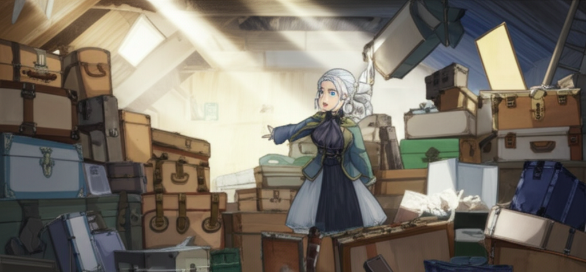

# Chapter 1: Chapter 1

## Chapter 1: Echoes in the Attic

Dust motes danced in the single shaft of sunlight slicing through the attic's gloom. Amelia coughed, waving a hand in front of her face, the smell of aged wood and forgotten things heavy in the air. She tightened the scarf around her neck, warding off the chill that clung to the space like a damp shroud.

*“Are you sure this is the right place, Gran?”* she called out, her voice echoing slightly in the cavernous room.

Her grandmother, Elara, emerged from behind a towering stack of antique trunks. Her silver hair was pulled back in a severe bun, and a glint shone in her usually gentle blue eyes. *“Of course, I’m sure, Amelia. Your grandfather stored… well, everything, up here. This attic is a treasure trove of forgotten memories, you see.”*

Amelia surveyed the scene. It was more than a treasure trove; it was a labyrinth. The attic stretched the entire length of the old Victorian house, crammed with furniture draped in white sheets, stacks of yellowed newspapers tied with twine, and boxes overflowing with knick-knacks and curiosities. It was a testament to a life well-lived, or perhaps one too cluttered to let anything go.

*“A treasure trove of dust and mothballs, more like,”* Amelia muttered, wrinkling her nose. She wasn't thrilled about spending her summer holiday sorting through her deceased grandfather's possessions. Her friends were at the beach, hiking in the mountains, generally having a good time. Meanwhile, she was trapped in her grandmother's creaky old house in the sleepy seaside town of Seabrook, inhaling decades of accumulated dust and regret.

Despite her age, Elara moved with surprising agility, navigating the crowded space with practiced ease. *“Don't be so cynical, dear. You might be surprised at what we find. Your grandfather was a remarkable man, you know. He led a remarkable life.”*

Amelia knew the story, or at least, the official version. Her grandfather, Arthur, had been a renowned marine biologist, a man of science and reason who had travelled the world studying the mysteries of the ocean. He had been a pillar of the community in Seabrook, a devoted husband and father. He had died three years ago, and the light had gone out of Elara's eyes the moment he passed.

Since then, Elara had become increasingly withdrawn, spending her days in the garden, tending her roses, and lost in her own thoughts. Amelia's parents, worried about their mother's isolation, had practically forced Amelia to spend the summer with her, hoping her youthful energy would spark a change.

*“So, where do we even begin?”* Amelia asked, gesturing at the overwhelming chaos.

Elara pointed towards a small, unassuming wooden chest tucked away in a corner. *“Start with that one. That's where he kept… his most precious things.”*

---

Amelia approached the chest, her curiosity piqued. It was surprisingly heavy for its size, the wood dark and worn with age. She ran her fingers over the intricately carved design, a swirling pattern of waves and seashells. There was no lock, only a simple brass clasp.

Taking a deep breath, Amelia unclasped the chest and lifted the lid. Inside, nestled on a bed of faded velvet, were several objects: a tarnished silver locket, a worn leather-bound journal, a collection of sea glass in varying shades of green and blue, and a single, perfectly preserved starfish.

*“Wow,”* Amelia breathed, her fingers hovering over the contents. These weren't just random objects; they were imbued with history, whispering untold stories.

Elara watched her, a wistful smile playing on her lips. *“Those were his treasures, Amelia. Fragments of his life, memories he held dear.”*

Amelia picked up the silver locket. It was intricately engraved with a nautical compass on one side and a delicate rose on the other. She carefully opened it, revealing two tiny portraits. One was of a younger Elara, her eyes sparkling with life, her hair a vibrant shade of auburn. The other was of a young man with a mischievous grin and eyes that mirrored the deep blue of the ocean.

*“Who's that?”* Amelia asked, pointing to the young man.

Elara's smile faltered, and a shadow crossed her face. *“That… was someone he knew a long time ago. Someone he lost.”*

She quickly changed the subject. *“Now, look at the journal. That's where the real story lies.”*

Amelia placed the locket back in the chest and picked up the journal. The leather was soft and supple, worn smooth by countless hours of use. She opened it carefully, the pages filled with Arthur's neat, meticulous handwriting.

---

The first entry was dated over fifty years ago, a youthful account of his first voyage as a research assistant. As Amelia read further, she was drawn into Arthur's world, a world of scientific exploration and boundless curiosity. He wrote of the wonders of the deep sea, the beauty of coral reefs, and the thrill of discovering new species.

But as she continued reading, a different narrative began to emerge, woven between the lines of scientific observation. He wrote of a profound connection with the ocean, a sense of being drawn to its depths, and a recurring dream of a place he called *"Aethelgard,"* a mythical island shrouded in mist and legend.

Then, he wrote about a girl. Not Elara, but a girl with sea-green eyes and hair the colour of seaweed after a storm. Her name was Lyra, and she was as wild and untamed as the ocean itself.

Amelia’s heart pounded in her chest. *“Gran, who is Lyra? He… he wrote about her like she was everything to him.”*

Elara’s face was ashen, her eyes fixed on the dusty floor. *“Lyra was… a friend. A very old friend.”*

Amelia wasn't convinced. There was a pain in Elara's voice, a subtle tremor in her hands that betrayed a deeper truth. This wasn't just a friend; this was something significant, something that had shaped Arthur's life in ways Amelia couldn't yet understand.

*“He writes about Aethelgard too, Gran. He dreamt about it, like it was calling to him.”* Amelia turned the page, her fingers tracing the delicate ink. *“He wrote about losing Lyra there, about… about losing her forever.”*

---

Elara remained silent for a long moment, her gaze lost in the distant past. Finally, she spoke, her voice barely above a whisper. *“Aethelgard… was a place they created together. A place in their minds, a sanctuary. But sometimes, even the most beautiful sanctuaries can become prisons.”*

*“What happened to Lyra, Gran? What happened on Aethelgard?”* Amelia pressed, her voice urgent.

Elara closed her eyes, a single tear tracing a path down her wrinkled cheek. *“That's a story for another day, Amelia. A story that's best left buried.”*

But Amelia wasn't willing to let it go. She could feel the weight of Arthur's lost memories pressing down on her, the echoes of a life lived and a love lost. She knew, with a certainty that resonated deep within her, that this summer wouldn't just be about sorting through her grandfather's belongings; it would be about uncovering the truth about Lyra, about Aethelgard, and about the secrets that lay hidden in the depths of her grandfather's heart.

*“I want to know, Gran. I need to know.”*

She looked at her grandmother, her eyes filled with a newfound determination.

Elara looked back at her, her eyes filled with a mixture of fear and resignation. *“Very well, Amelia. But be warned… some memories are best left undisturbed. Some doors are best left unopened. Because once you step inside, there's no turning back.”* She paused, her voice dropping. *“You'll be lost in your memories forever.”*

---

The weight of her grandmother's words settled upon Amelia like the dust in the attic. **Lost in your memories forever.** It was a warning. A warning that Amelia, driven by an insatiable curiosity and a yearning to understand the past, was determined to ignore.

She picked up the journal again, the faded ink beckoning her forward. The story of Lyra and Aethelgard was waiting to be told, and Amelia was ready to listen, even if it meant venturing into the darkest corners of her grandfather's past, and perhaps, her own. The attic, once just a repository of forgotten things, had become a gateway to a lost world, a world that held the key to unlocking the secrets of a lifetime. **And as the afternoon sun began to fade, casting long shadows across the room, Amelia knew that her summer in Seabrook was about to become something far more extraordinary, and far more dangerous, than she could have ever imagined.**