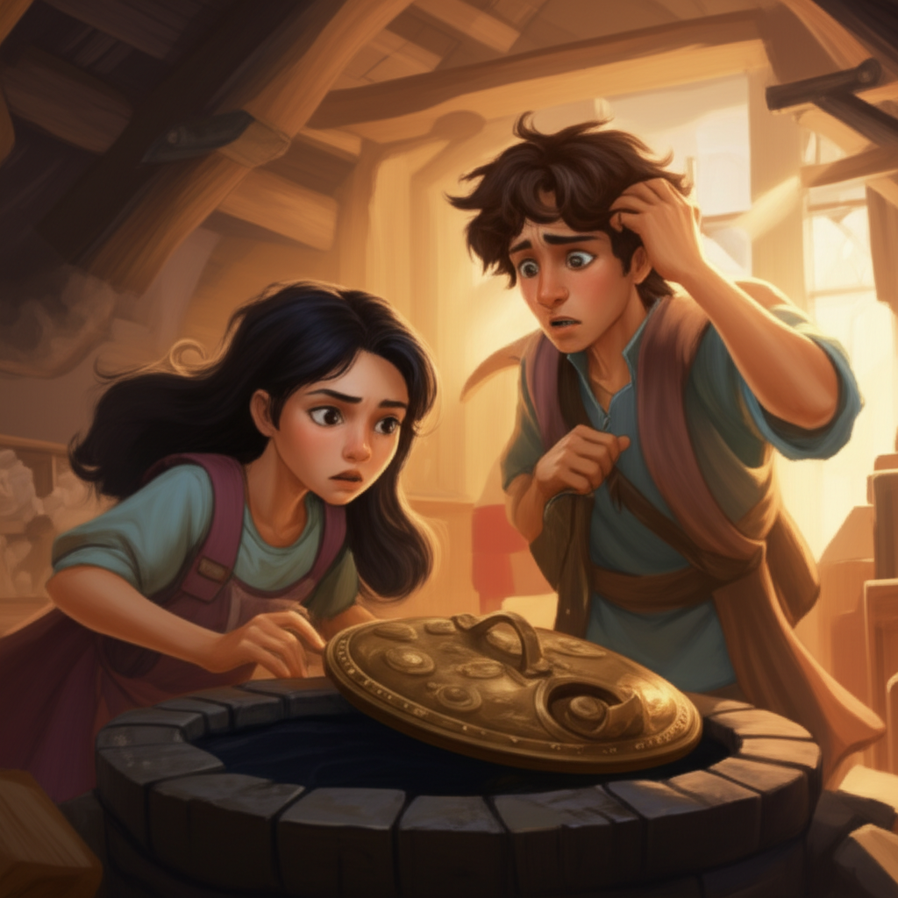

# Chapter 2: Chapter 2

## Chapter 2: Echoes in the Well

Dust motes danced in the single, weak shaft of sunlight that pierced the gloom of the attic, illuminating Amelia's face as she exhaled a nervous puff of air. The air itself hung thick – a cloying mixture of mothballs, dried lavender, and something indefinably ancient, a scent that spoke of forgotten decades. This was it. According to Grandfather Silas's rambling notes, this was the gateway, the heart of *"Lost in Your Memories Forever.*"* The place he claimed held the key to... well, everything she was desperately searching for.

Beside her, Leo shifted, the aged floorboards groaning under his weight. He ran a hand through his perpetually messy brown hair, his usually jovial face now etched with a grim seriousness that mirrored Amelia's own unease. *“You sure about this, Amelia? This place feels… wrong. Like we're intruding on something that wants to be left alone.”*

Amelia didn't immediately reply, her gaze locked on the object that dominated the attic: a well. Not a typical well. This one was crafted from dark, almost obsidian stone, its surface intricately etched with symbols she couldn't decipher. A heavy, tarnished brass lid capped it, pierced only by a small, circular opening that allowed the thin sunbeam to penetrate the darkness within.

*"*Grandfather Silas believed it was a portal,*"* she finally said, her voice barely a whisper. *"*A portal to... our memories.*"*

Leo snorted, the sound echoing strangely in the confined space. *“Seriously? A portal to our memories? That sounds like something ripped from a B-movie script.”*

*"*I know it sounds crazy,*"* Amelia conceded, turning to face him, her green eyes pleading. *"*But you know Grandfather. He wasn't… typical. And he dedicated his life to this. He believed it could help us recover what we've lost.*"*

Leo sighed, the fight visibly draining out of him. He knew better than to argue with Amelia when she wore that particular look – a blend of raw desperation and fierce determination. He'd known her since they were children, their lives as intertwined as the ancient ivy that crawled up the walls of Blackwood Manor, the ancestral home they now stood within. Deep down, he knew he would follow her anywhere, even if it meant venturing into a supposedly memory-bending well in a dusty attic.

*“Alright,”* he conceded, his tone laced with reluctant humor, *“but if we start hearing voices from our past telling us to invest in tulip bulbs, I'm out.”*

Amelia managed a weak smile, her relief evident. *"*Deal.*"* She rummaged in her backpack, pulling out a thick, leather-bound journal, its pages crammed with Silas Blackwood's cryptic handwriting. *"*Now, according to Grandfather's notes…*"*

---

*"*He says the symbols on the well are key to activating the portal. They need to be… resonated with. But I don’t know *how*.*"* She ran a finger over the strange glyphs carved into the stone. They seemed to writhe and shift in the weak, filtered light.

Leo crouched down, examining the symbols with a more analytical eye. *"*They look almost like musical notes. Maybe they're meant to be sung?*"*

Amelia's eyes widened. *"*That's brilliant, Leo! Grandfather was a composer, after all. He always saw patterns in everything, even memories. He might have encoded a melody into the symbols.*"*

Together, they began to hum, tentatively at first, then with increasing confidence. They experimented with different scales, different rhythms, searching for a resonance, a vibration that felt right. The air in the attic seemed to grow colder, the shadows deepening around them.

Suddenly, a high-pitched whine sliced through the air, making their teeth ache. The brass lid of the well began to tremble violently, showering dust down from the rafters.

*"*Stop!*"* Amelia shouted, her voice strained with a mixture of excitement and trepidation. *"*It's working! But… something's not right.*"*

The whine intensified, the vibrations growing stronger and more erratic. The symbols on the well pulsed with an eerie, unnatural green light. The air crackled with energy, making the hairs on their arms stand on end. Then, with a deafening clang that reverberated through the house, the brass lid was thrown open, revealing the inky blackness within.

A swirling vortex of colors erupted from the well – a kaleidoscope of greens, blues, and purples that seemed to beckon them forward. The scent of lavender grew overwhelming, almost cloying, mixed with a metallic tang that made Amelia's stomach churn.

*“What *is* that?”* Leo asked, his voice laced with genuine fear.

*"*I don't know,*"* Amelia breathed, mesmerized and terrified in equal measure. *"*But it's calling to me. It's calling to *us* both.*"*

The vortex widened, completely engulfing the opening of the well. Amelia felt a pull, a powerful tug on her very being, drawing her inexorably closer. She stumbled forward, her hand outstretched, drawn to the swirling colors like a moth to a flame.

*“Amelia! Don't!”* Leo grabbed her arm, desperately trying to pull her back. But the force was too strong, unnatural. He was being pulled forward as well, dragged towards the swirling abyss against his will.

*"*Leo, I have to do this,*"* Amelia said, her voice strangely detached, almost hypnotic. *"*I have to find them. I have to remember.*"*

Before Leo could respond, they were both sucked into the vortex, the world around them dissolving into a chaotic swirl of color and sensation. **The last thing Amelia saw before the darkness consumed her was the stark, terrified look etched on Leo's face.**

---

Amelia gasped, her lungs burning for air. She lay on a soft, mossy surface, the air thick with the scent of pine and damp earth. Above her, the canopy of ancient trees formed a dense latticework of green, dappled with sunlight. She sat up, disoriented, her head throbbing with a dull, persistent ache.

*"*Leo?*"* she called out, her voice hoarse with fear. *"*Leo, where are you?*"*

There was no response, only the rustling of leaves in the unseen breeze and the distant, melodic song of birds. Amelia stood up, her legs unsteady beneath her. She was in a forest, a forest unlike any she had ever seen before. The trees were impossibly taller, their leaves a deeper, more vibrant shade of green. The air was fresher, cleaner, imbued with a sense of primordial stillness.

She took a tentative step forward, then another, her eyes frantically scanning her surroundings. She recognized nothing. This wasn't Blackwood Forest, the familiar woods that bordered Blackwood Manor. This was… something else entirely, something older and wilder.

As she walked, she began to hear voices – whispers on the wind. They were faint, almost imperceptible, but they seemed to be calling her name, their tones sorrowful and beseeching. She strained her ears, trying to make out what they were saying.

*"*Amelia… remember…*"*

*"*Find us…*"*

*"*The key is within…*"*

The voices grew louder, more insistent, drawing her deeper into the heart of the alien forest. She followed them blindly, her heart pounding against her ribs, fear warring with a desperate hope.

Suddenly, she stumbled into a clearing. In the center stood a single, ancient oak tree, its branches reaching towards the sky like gnarled, supplicating fingers. Beneath the tree, nestled amongst its exposed roots, was a small, stone cottage.

The cottage was overgrown with ivy, its windows dark and shuttered, its overall appearance one of profound abandonment. It looked forgotten, swallowed by the relentless embrace of nature. Yet, as Amelia approached, she felt a powerful pull, a familiar tug deep within her heart. She knew, with a certainty that defied all logic, that she had been here before.

She pushed open the creaking wooden door and stepped inside. The air within the cottage was cool and damp, heavy with the smell of dust and decay – even stronger than in the attic. The furniture was draped in protective white sheets, the walls lined with towering bookshelves filled with crumbling, leather-bound volumes.

As her eyes gradually adjusted to the dim light, she noticed something on the mantelpiece above the long-cold fireplace. It was a photograph – a faded black and white image encased in a simple silver frame. She picked it up, her fingers trembling.

In the photograph, a young girl with bright green eyes and unruly brown hair stood beside a young boy with messy brown hair and a perpetually mischievous grin. They were standing in a vibrant garden, surrounded by a riot of colorful flowers, their faces radiant with unadulterated joy.

Amelia stared at the photograph, her breath catching in her throat, a lump forming in her chest. The girl was her. The boy was Leo. But they looked younger, healthier, happier, more carefree than she could ever remember being.

And then, **a tidal wave of memories crashed over her**, flooding her senses, overwhelming her with their intensity. She remembered the garden, the flowers, the carefree laughter. She remembered playing hide-and-seek amongst the towering trees, building elaborate forts in the woods, dreaming of grand adventures together.

She remembered… everything.

But as the vibrant memories returned, so too did the agonizing truth of why they had been lost in the first place. The accident. The devastating fire. The crushing loss that had irrevocably shattered their lives and cruelly erased their shared past.

The pain was unbearable, a crushing weight on her chest that stole her breath. She stumbled backward, clutching the photograph tightly to her heart, hot tears streaming uncontrollably down her face.

*"*It's all coming back,*"* she whispered, her voice choked with raw emotion. *"*It's all coming back… and it hurts so much.*"*

---

Suddenly, she heard a sound behind her, a subtle shift in the air. She whirled around, her heart pounding erratically in her chest, her senses on high alert.

Standing in the doorway, silhouetted against the soft, fading light of the forest, was a figure. A tall, slender figure with familiar messy brown hair and a decidedly mischievous grin playing on his lips.

*"*Leo?*"* Amelia whispered, her voice barely audible, a desperate plea hanging in the air. *"*Is that really you?*"*

The figure stepped forward, slowly emerging into the dim light. It was Leo, undeniably. But he looked different, changed. Younger, more vibrant, with a spark of youthful energy in his eyes that she hadn't seen in years, perhaps even decades.

He smiled, a warm, achingly familiar smile that sent unexpected shivers down her spine.

*"*Welcome back, Amelia,*"* he said, his voice soft and gentle, filled with a knowing warmth. *"*Welcome back to Lost in Your Memories Forever."*

Amelia stared at him, her mind reeling, struggling to process the impossible scene unfolding before her eyes. What *was* this place? Was it real, or merely an elaborate, cruel illusion? Was it a vivid dream from which she would soon awaken? Or was it something else entirely, something far more complex and profound?

And more importantly, could she and Leo truly reclaim the past they had lost, or were they doomed to remain forever trapped within the seductive, yet ultimately fragile, echoes of their own long-forgotten memories?