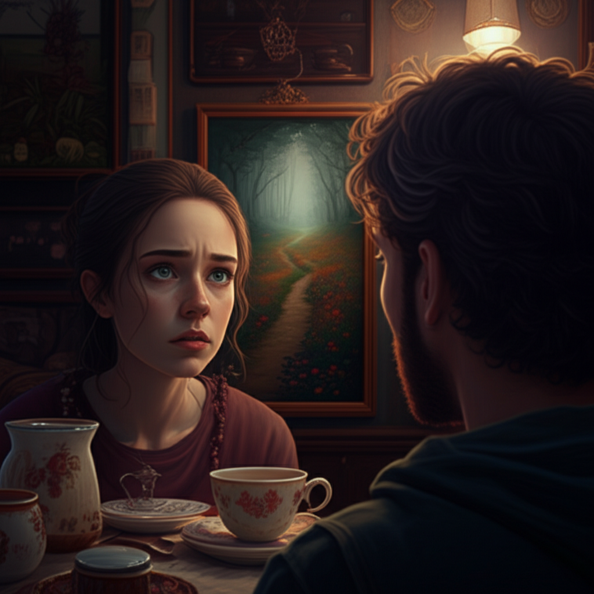

# Chapter 3: Chapter 3

Okay, here's the formatted chapter content according to your guidelines:

**Chapter 3**

The chipped porcelain teacup trembled in Elara's hand, mirroring the tremor in her heart. Across the small, cluttered table, Liam leaned forward, his brow furrowed with concern. The air in the Memory Lane Tea Room hung heavy with lavender and something indefinably *old* – dried paper and forgotten stories clinging to the faded wallpaper.

*“Are you alright, Elara?”* Liam's voice was soft, laced with worry. *“You've been staring at that painting…for ages.”*

Elara forced a smile, a brittle, unnatural curve of her lips. *“Sorry. It just… feels familiar.”*

The painting in question hung beside their table, one of many vying for space on the crowded wall. It depicted a winding path, almost swallowed by wildflowers, leading into a dense, misty forest. The colors were muted, faded almost to whispers, yet the light possessed a quality both inviting and unsettling. It was a light Elara felt she *knew*, not intellectually, but deep in her gut.

*“Familiar how?”* Liam pressed, gently persistent. He'd been endlessly patient since their arrival in Everbrook a week ago – patient with her mounting anxiety, the sleepless nights, and the increasingly vivid, fragmented memories that clawed at the edges of her awareness.

*“I can't explain it,”* Elara sighed, setting down her teacup with a soft clink. *“It's like… I've walked that path before. I can almost feel the sun on my skin, smell the flowers, the coolness beneath the trees. But it’s all just… a ghost of a sensation.”*

Liam reached across the table and took her hand, his touch a welcome anchor. *“That's why we're here, Elara. To chase those ghosts. To find out what happened.”*

He was right. After the accident, the car crash that had robbed her of three years, leaving behind a shattered mosaic of memories and a profound sense of loss, her therapist had suggested Everbrook. A place, apparently, associated with lost memories and second chances, where the veil between past and present was said to be thin. And Liam, her steadfast childhood friend, had brought her.

Elara glanced around the tea room. Mrs. Hawthorne, the elderly woman behind the counter, offered a kind smile, her eyes holding an unnerving knowingness. The other patrons, mostly older couples, sipped tea in comfortable silence, their faces maps of long lives lived. Everything about Everbrook was both comforting and deeply unsettling.

*“Let's talk to Mrs. Hawthorne,”* Elara said, a sudden surge of determination coursing through her. *“She seems to know more than she lets on.”*

Liam nodded. *“Good idea. But finish your tea first. You need the sugar.”*

---

They finished in silence, the weight of unspoken questions heavy between them. Finally, Elara rose and approached the counter.

Mrs. Hawthorne was polishing a silver teapot, her movements slow and deliberate. *“Can I help you, dear?”* Her voice, surprisingly strong for her age, held a hint of a melodic rasp.

*“I was wondering,”* Elara began hesitantly, *“about that painting. The one with the path leading into the woods.”*

Mrs. Hawthorne paused, her gaze meeting Elara’s. *“Ah, 'The Wanderer's Way.' An old piece. Been here for… well, longer than I can rightly say.”*

*“Do you know who painted it?”*

Mrs. Hawthorne shook her head. *“No one knows. It simply… appeared one day, years ago. Some whisper it's a portal. Others, that it’s just a pretty picture. What do *you* think, dear?”*

A shiver traced Elara's spine. *“I think… I think I need to walk that path.”*

Mrs. Hawthorne’s eyes widened almost imperceptibly. *“Are you sure, child? 'The Wanderer's Way' leads deep into the Whisperwood. It's easy to get lost there, not just physically, but… in other ways.”*

*“I have to try,”* Elara insisted. *“I feel like it's the key to unlocking my memories.”*

Mrs. Hawthorne sighed, a sound like rustling leaves. *“Very well. But be warned. The Whisperwood has a way of reflecting your deepest desires and your darkest fears. Be careful what you wish for.”*

She reached beneath the counter and produced a small, intricately carved wooden compass. *“Take this. It won't point you to true north, but it will guide you towards what you're searching for. Trust your instincts, and listen to the whispers of the wood.”*

Elara accepted the compass, her fingers brushing Mrs. Hawthorne's. A jolt of energy sparked between them, a fleeting vision of a young woman with long, flowing hair fleeing through a forest, her face contorted with terror. The image vanished as quickly as it appeared.

*“Thank you,”* Elara whispered, her voice catching in her throat.

---

She rejoined Liam at the table, her heart hammering against her ribs. *“She gave me this,”* she said, showing him the compass. *“She says it will guide me.”*

Liam examined the compass, his expression skeptical. *“Are you sure about this, Elara? It sounds… dangerous.”*

*“I have to do it, Liam. I have to know.”*

He looked at her, concern etched in his features, but he saw the unwavering resolve in her eyes. He knew there was no dissuading her.

*“Alright,”* he conceded. *“I'm going with you.”*

Relief washed over Elara, relaxing the taut muscles in her shoulders. *“Thank you, Liam.”*

They left the tea room, stepping into the afternoon sun. The air was crisp and clean, scented with pine and damp earth. Elara gazed toward the edge of the village, where the Whisperwood loomed, a dark and mysterious presence.

As they walked, Liam asked, *“What did Mrs. Hawthorne mean about 'reflecting your deepest desires and darkest fears'?”*

Elara hesitated. *“I don't know exactly. But I have a feeling I'm about to find out.”*

---

The entrance to the Whisperwood was marked by a weathered wooden archway, choked with ivy. Carved into the arch, barely visible beneath the foliage, were the words: *"Enter at your own peril."*

Elara took a deep breath and stepped beneath the archway, Liam close behind. As soon as they crossed the threshold, the air grew noticeably cooler, and the light dimmed, filtered through a dense canopy. The sounds of the village faded, replaced by the rustling of leaves and the distant call of an unseen bird.

They found the path from the painting almost immediately – narrow and overgrown, but unmistakably there. Elara consulted the compass. The needle spun wildly for a moment, then settled, pointing deeper into the woods. She followed, the compass her only guide.

The forest grew denser, the shadows deeper. Strange shapes danced in the periphery, and the air thrummed with an almost palpable energy. Elara felt the weight of the trees pressing down, sensed the unseen eyes watching their every move.

Suddenly, a voice echoed through the trees, soft and melodious, like a lullaby carried on the breeze.

*“Elara…”*

Elara stopped, her heart leaping into her throat. *“Did you hear that?”* she whispered, her voice barely audible.

Liam nodded, his face pale and drawn. *“Yeah. It sounded like… someone calling your name.”*

The voice came again, closer this time.

*“Elara… come home…”*

A pull, an irresistible urge to follow the sound, tugged at Elara. She began to walk, her movements almost dreamlike.

*“Elara, wait!”* Liam called, but she barely registered his words.

---

The voice lured her deeper, past gnarled trees and moss-covered rocks. The path began to dissolve, swallowed by tangled undergrowth.

Finally, she reached a clearing. In its center stood a figure, shrouded in shadow. As Elara approached, the figure stepped into the light, revealing a woman with long, flowing hair and eyes that glowed with an unnatural luminescence.

The woman smiled, a chilling, predatory curve. *“Welcome home, Elara.”*

Elara stared, her mind reeling. She *knew* this woman, recognized something fundamental, but she couldn’t grasp the connection.

*“Who are you?”* Elara asked, her voice trembling, barely a breath.

The woman's smile widened, revealing a hint of something cruel. *“I am you, Elara. The you you've been trying so hard to forget.”*

A wave of dizziness washed over Elara. She felt poised on the edge of an abyss, staring down into a chasm of lost memories and buried secrets. The Whisperwood wasn't just a place to *find* lost memories, she realized. It was a place to *confront* them. And the woman standing before her embodied everything she had been running from.

Liam caught up, his face a mask of worry. He stopped dead when he saw the woman in the clearing.

*“Elara, who *is* that?”* he asked, his voice laced with alarm.

The woman turned her gaze to Liam, her eyes narrowing with disdain. *“He doesn't belong here, Elara. He's just a distraction.”*

*“No!”* Elara cried, finding her voice. *“He's my friend. He's helping me.”*

The woman laughed, a cold, sharp sound that echoed through the clearing. *“Helping you *forget*, you mean. Helping you stay lost in the shadows.”*

A chilling certainty settled over Elara. The woman was right. She had been using Liam as a shield, a buffer against the pain of her past. But she could no longer hide. She had to face the truth, no matter how terrifying.

**“I'm not afraid of you,”** Elara said, her voice trembling but firm. **“I'm not afraid of my memories.”**

---

The woman's smile vanished, replaced by a look of pure, unadulterated hatred. *“Then you're a fool, Elara. You'll regret this.”*

She raised her hand, and the air around them crackled with energy. The trees swayed violently, their branches thrashing like tormented limbs. The ground trembled beneath their feet. The Whisperwood was alive, and it was about to unleash its fury.

Elara braced herself, ready to face whatever horrors the forest had in store. She knew this was just the beginning. The journey into her lost memories had only just begun, and it would be long and arduous. But she wasn't alone. Liam was by her side, and she possessed the courage to face the truth, no matter how agonizing. The whispers of the wood, she understood now, weren't just a warning. They were a guide. And she was finally ready to listen.