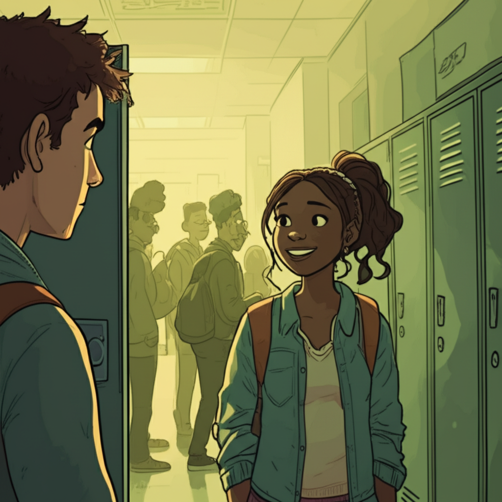

# Chapter 1: Chapter 1

## Chapter 1: Geometry, Guava, and Glimmers

The fluorescent lights of Northwood High had a knack for leaching the color from everyone, leaving them looking sickly, almost… green. Especially at 7:30 AM. You could see it etched on the faces of students shuffling toward their lockers, clutching lukewarm coffees and half-eaten granola bars like lifelines. But even in that pre-dawn pallor, Maya radiated.

I watched her, as I did every morning, from my locker, a few feet down and across the hall. Maya. Her perpetually messy ponytail always threatening to unravel, the way her eyes crinkled at the corners when she smiled, the worn-out Converse that probably held more stories than the school library. She was a walking, talking kaleidoscope of everything I wasn't: confident, artistic, unapologetically herself.

This was tenth grade. And she was my silent, secret obsession.

---

Northwood High, nestled in the sleepy suburban sprawl of Meadow Creek, wasn’t exactly a breeding ground for romance. AP exams and Friday night football games were the local obsessions, neither of which particularly interested me. I was a solid B student, content to blend into the back of the classroom, sketching in my notebook, and generally avoiding the spotlight. Maya, on the other hand, thrived under it. She was the lead in the school play, captain of the debate team, and, rumor had it, even had a burgeoning career as a street artist – a rumor she neither confirmed nor denied, fueling the mystique.

I, of course, was just… Liam. Observant Liam. The guy who always had a spare pencil, could solve a Rubik's cube blindfolded, and spent an inordinate amount of time daydreaming about the girl who walked past his locker every morning without ever truly *seeing* him.

This morning, Maya was surrounded by her usual constellation of friends: Chloe, the fiery redhead with a penchant for dramatic pronouncements; Ben, the easygoing musician who always had a guitar slung over his shoulder; and Sarah, the quiet, brilliant one who always seemed to know the answer before the question was even asked. They were laughing, their voices echoing in the otherwise sterile hallway, as Maya brandished something green from her backpack.

*“Guava?”* Chloe wrinkled her nose, recoiling slightly. *“Seriously, Maya? It smells like sweaty socks.”*

Maya just shrugged, a mischievous glint in her eyes. *“It’s the best fruit in the world. You’re all just uncultured swine.”*

Ben chuckled, reaching for a piece. *“Alright, alright, I’ll try it. But if I barf on Mrs. Henderson’s history notes, I’m holding you personally responsible.”*

They continued to chatter and share the guava, oblivious to the silent storm brewing just a few feet away. My palms were slick. My throat felt like sandpaper. **This was it.** This was my chance.

---

I’d spent weeks rehearsing scenarios in my head. *"Accidental*"* bumps in the hallway. Dropped books leading to shared laughter. All meticulously designed to catch Maya’s attention, to make her see me, Liam, as something more than just background noise.

I took a deep breath, my fingers tightening around the cold metal of my locker door. I started to rehearse my opening line in my head, like an actor before a critical audition.

*"*Hey, Maya...*"* Too generic, too bland.

*"That's a really... interesting fruit...*"* Too awkward, too try-hard.

*"Did you know that guava is actually considered a superfood due to its high antioxidant content...*"* Definitely too dorky. Instant friend-zone material.

Before I could land on the perfect phrase, the bell shrieked, shattering the fragile illusion of my carefully constructed plans. The hallway erupted in a chaotic surge of students, all scrambling for their respective classrooms. Maya and her friends were swept away in the tide, disappearing into the throng of backpacks and hurried footsteps.

My chance… gone. Again.

Sighing, I slammed my locker shut, the hollow *thunk* echoing the disappointment in my chest. Geometry was next. Mrs. Peterson. Right angles and hypotenuses. Exactly the kind of soul-crushing monotony I needed to distract myself from the burning sting of my hopeless infatuation.

As I trudged towards the math wing, I couldn’t resist one last glance back down the hall. Maya was gone. But a single, small, slightly bruised piece of guava lay abandoned on the floor, a tiny monument to my failed courage.

---

I picked it up, the action almost involuntary.

It was still slightly sticky, faintly fragrant. I cradled it in my palm, a tiny, green reminder of the impossible chasm between my reality and my fantasy.

Geometry wasn’t much better. Mrs. Peterson, a woman whose dedication to triangles bordered on the religious, droned on about congruent angles and parallel lines. I tried to focus, mechanically scribbling notes in my notebook, but my mind kept spiraling back to Maya. To the guava. To the agonizing missed opportunity.

Beside me, Sarah coughed pointedly. I glanced over to see her peering at my notebook, her brow furrowed slightly.

“Nice drawing,” she said, her voice barely a whisper, as if sharing a secret.

I glanced down at the page, my cheeks flushing. Without even realizing it, I’d sketched a remarkably detailed rendering of the guava, capturing its imperfections, the subtle variations in color, the faint remnants of its sticky residue.

*"Oh, uh, thanks,*" I mumbled, suddenly acutely self-conscious. I hadn't even known I was drawing.

*"*You're pretty good,*"* she continued, pushing her glasses further up her nose. *"*You should join the art club. Maya's in it, you know."*

My heart skipped a beat, then took off like a hummingbird. Art club? Maya? *Proximity*? Possibility bloomed in my chest like a fragile flower.

“Art club?” I repeated, trying to sound nonchalant, as if this wasn't the most earth-shattering revelation I'd received all week. “I… I didn’t know that.”

Sarah shrugged. “Yeah. They meet on Tuesdays and Thursdays after school in room 207. They’re working on a mural for the cafeteria right now. Pretty cool stuff.”

The bell rang, slicing through the conversation and signaling the end of class. As students scrambled to pack their bags, Sarah turned to me, a ghost of a smile playing on her lips.

“Just a thought,” she said, her eyes twinkling slightly, and then she was gone, leaving me buzzing with a strange mixture of hope and terror.

---

Room 207. Tuesdays and Thursdays. The information swirled in my head, a lighthouse beam cutting through the fog of my high school existence.

Maybe… maybe **this was it.** Maybe this was the chance I’d been desperately waiting for.

The rest of the day passed in a blur of textbooks and lectures. But my mind wasn't on quadratic equations or the causes of the American Revolution. It was on art club. On room 207. On Maya. Each tick of the clock felt like a hammer blow, driving me closer to a moment of either spectacular triumph or crushing humiliation.

By the time the final bell rang, I was a raw nerve. My palms were sweating again, leaving damp prints on my locker. My stomach was a churning sea of anxiety. I considered skipping art club. Inventing a plausible excuse. Feigning a sudden, debilitating illness.

But then I remembered the guava. The small, sticky, almost pathetic piece of green that represented my longing, my yearning, my hopelessly idealistic crush. And I knew, with a certainty that surprised even myself, that I couldn't back down.

Taking a deep, fortifying breath, I headed towards the art wing, my heart hammering against my ribs like a desperate drummer.

---

Room 207 was easy enough to find. The door was slightly ajar, and the sounds of laughter and chatter spilled out into the hallway, a siren song beckoning me closer. I hesitated, my hand hovering inches from the doorknob, paralyzed by a wave of self-doubt.

What if she didn't like me? What if I said something unforgivably stupid? What if I completely and utterly embarrassed myself beyond all hope of redemption?

Taking another deep breath, forcing my hand to move, I pushed the door open.

The room was a riot of color. Canvases leaned against the walls, covered in swirling patterns and bold, abstract designs. Brushes and paint tubes littered the tables, transforming the space into a vibrant, chaotic wonderland. The air hung thick with the pungent scent of turpentine, a smell that somehow felt both intimidating and strangely liberating. And there, standing in the middle of it all, her hands smeared with vibrant hues of crimson and cerulean, was Maya.

She was laughing, her head thrown back, her ponytail bouncing with unrestrained energy. She was beautiful. Breathtakingly, impossibly beautiful. The kind of beautiful that stole your breath and made your palms sweat.

I stood frozen in the doorway, utterly captivated, the anxieties of the afternoon melting away in the heat of the moment. She hadn't seen me yet. **This was it.** My moment of truth.

I opened my mouth to speak, to finally conjure the courage to say something, anything, that would make her notice me, *really* notice me.

But before I could utter a single word, she turned, her eyes widening in surprise as she spotted me lurking in the doorway.

*“Liam?”* she said, her voice a mixture of surprise and… something else I couldn't quite decipher. *“What are you doing here?”*

And just like that, the kaleidoscope shattered. The colors blurred and swirled, losing their sharp definition. The dream flickered, threatening to extinguish entirely.

Because the way she said my name… it wasn't the way I'd meticulously imagined it in my head. There was no spark of recognition. No flicker of curiosity. No hint of… *anything*.

It was just a name. A name uttered with mild surprise, a simple, almost indifferent question hanging in the air between us.

And in that instant, standing in the doorway of room 207, surrounded by the vibrant chaos of the art club, I knew, with a sinking certainty, that my tenth-grade love story wasn't going to be the fairy tale I'd so desperately conjured in my mind. It was going to be something… else. Something far more complicated. Something undeniably… incomplete.

This was just the beginning. And I had a feeling, deep in my gut, that it was going to be a wild, unpredictable, and potentially heartbreaking ride.
