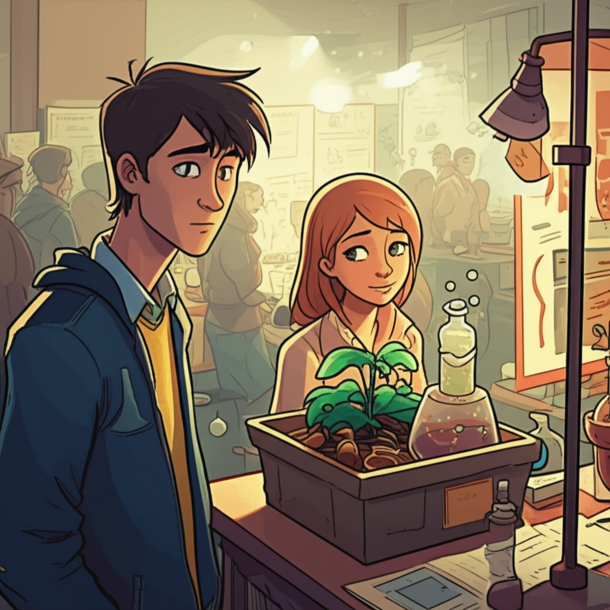

# Chapter 2: Chapter 2

## Chapter 2: The Science Fair Conspiracy and Stolen Glances

The aroma of burnt popcorn, perpetually clinging to everything in Northwood High, hung extra thick in the cafeteria, transformed tonight into a makeshift laboratory for the annual Science Fair. Beakers bubbled precariously on rickety folding tables, potato clocks flickered with intermittent life, and posters showcasing meticulously (and sometimes laughably not-so-meticulously) researched topics papered every available inch of wall space. My project, a rather ambitious—and, let's be honest, probably doomed—attempt to create a self-watering plant system using repurposed soda bottles and a labyrinthine network of tubing, occupied a precarious spot between Sarah Miller’s perpetually erupting volcano and Mark Thompson’s disturbingly detailed dissection of a fetal pig.

This was supposed to be my natural habitat. At least, that’s what I kept telling myself. But standing amidst the controlled chaos, a simmer of nervous anticipation battled with an overwhelming sense of dread. The anticipation, admittedly, stemmed from a genuine excitement for my project, flawed as it was. The dread? That was entirely Emily’s fault.

Emily Carter. The name still felt like a live wire on my tongue, sparking with energy even now. She was a supernova in the drab galaxy of Northwood High, a burst of artistic brilliance in a school obsessed with standardized tests. Her hair, a riot of untamed auburn curls, seemed to defy gravity itself. Her eyes, the color of jade, held a perpetual glint of amusement, as if she were privy to secrets the rest of us could only dream of deciphering. And her laugh… a melodic chime that could cut through the dreariest overcast day.

And she was here. At the Science Fair. Helping her younger brother, a freckled seventh-grader named Sam, with his surprisingly impressive model of the solar system. I’d spotted her only moments ago, her laughter echoing across the cafeteria as Sam nearly obliterated his painstakingly crafted Jupiter.

My heart hammered a frantic rhythm against my ribs. I gripped the edge of my table, feigning nonchalance as I pretended to adjust the (nonexistent) flow rate of my self-watering system. In reality, I was simply trying to avoid eye contact with the celestial being that was Emily Carter.

*"Looks… ambitious,*"* a voice drawled from beside me.

I jumped, nearly sending a beaker of nutrient solution crashing to the floor. It was Michael, my best friend since kindergarten and the only person who truly grasped my unique blend of awkwardness and earnestness. Lanky and perpetually sporting messy brown hair, he possessed an uncanny ability to inject humor into even the most serious situations.

*"*Thanks,*"* I mumbled, struggling to regain my composure. *"*It’s supposed to automatically water plants. Save the planet, one soda bottle at a time, you know?*"*

Michael raised a skeptical eyebrow. *"*And is it… working?*"*

I risked a glance at the system. One of the tubes had detached, leaving a spreading puddle of water on the table. *"*Working… optimally,*"* I corrected, my voice laced with false confidence.

He snorted. *"*Right. Well, good luck with that. I’m pretty sure Sarah’s volcano is about to claim the entire east wing of the school.*"* He gestured towards the bubbling, ominous concoction. *"*At least you won’t be alone in your spectacular failure.*"*

*"*Charming,*"* I said, forcing a weak smile.

Michael leaned closer, lowering his voice conspiratorially. *"*So… is she here?*"*

I knew exactly who he meant. I pointedly avoided looking in Emily’s direction. *"*Who?*"*

He rolled his eyes. *"*Don’t play coy, dude. Emily Carter. The sole reason you’ve been inexplicably obsessed with botany for the past two weeks. Is she gracing us with her radiant presence?*"*

I sighed, deflated. *"*She’s helping her brother.*"*

*"*Ah,*"* Michael said, a knowing grin spreading across his face. *"*Opportunity knocks, my friend. Go forth and conquer.*"*

*"*Conquer?*"* I scoffed, picturing the inevitable disaster. *"*I’m more likely to spill fertilizer on her than conquer anything.*"*

*"*Nonsense,*"* Michael said, slapping me on the back with more force than necessary. *"*Just be yourself. Or, you know, a slightly more confident version of yourself. And for the love of all that is holy, don’t, I repeat, do not talk about the intricacies of soil pH.*"*

He wandered off towards Sarah’s impending volcanic eruption, leaving me alone with my gurgling project and my increasingly frantic thoughts. Michael was right, of course. This was an opportunity. A chance to maybe, just maybe, have a real conversation with Emily.

---

Taking a deep breath, I straightened my slightly-too-large glasses and navigated my way towards the solar system display.

Sam was meticulously adjusting the orbit of Neptune, his brow furrowed in concentration. Emily was crouched beside him, the soft glow of the miniature sun bulb illuminating her face. She looked… impossibly perfect.

*"*Hey, Sam,*"* I said, attempting a casual tone that probably sounded anything but. *"*That’s a really impressive solar system.*"*

Sam looked up, a shy smile gracing his freckled face. *"*Thanks. Emily helped me a lot.*"*

Emily glanced up, her jade eyes locking onto mine. My heart executed a clumsy somersault, nearly knocking the wind out of me. *"*Hey,*"* she said, her voice like a gentle caress. *"*I didn’t know you were into science fairs.*"*

*"*I… well, I’m trying to be,*"* I stammered, gesturing vaguely in the direction of my malfunctioning self-watering system. *"*I’m… passionate about sustainable gardening.*"*

She chuckled, a sound that sent shivers down my spine. *"*Sustainable gardening? That’s… interesting.*"*

*"*Yeah,*"* I said, my brain desperately scrambling for something, *anything*, intelligent to say. *"*It’s… you know… good for the environment.*"*

*"*No, I get it,*"* she said, her eyes twinkling with amusement. *"*I’m actually really interested in botany myself. I’m thinking of taking AP Biology next year.*"*

AP Biology. The class I was already signed up for. This was fate. Or maybe just a convenient coincidence, but I preferred to think of it as fate.

*"*You should!*"* I blurted out, perhaps with a little too much enthusiasm. *"*It’s… it’s supposed to be really good. I’m taking it too.*"*

*"*Really?*"* she said, her eyebrows arching slightly in surprise. *"*Maybe we can study together.*"*

The words hung in the air between us, a tantalizing promise of future study sessions, shared laughter, and, dare I hope, something more. My heart soared, lighter than air. I was practically levitating.

*"*That would be… great,*"* I managed to say, my voice barely above a whisper, my palms sweating.

Then, disaster struck, in the form of baking soda and vinegar.

---

A deafening *CRASH* reverberated through the cafeteria. Everyone turned to see Sarah Miller’s volcano had finally succumbed to its own internal pressure, erupting in a frothy geyser of chemical reaction. The eruption itself, however, was merely a prelude to the true catastrophe. The real disaster was *where* the foam landed: directly on Emily Carter.

She gasped as the acidic mixture dripped from her auburn curls and splattered across her delicate face. I froze, paralyzed with horror.

Sarah, looking utterly mortified, stammered profuse apologies. *"*Oh my god, Emily! I’m so, so sorry!*"*

Emily, wiping the foam from her eyes, managed a weak, albeit strained, smile. *"*It’s okay, Sarah. Accidents happen.*"*

But I couldn’t just stand there, a helpless bystander. I had to *do* something. Anything.

*"*Here,*"* I said, fumbling desperately in my pocket for a tissue. *"*Let me… let me help you with that.*"*

My hand trembling, I reached out and gently began to wipe the foam from her cheek. My fingers brushed against her skin, sending a jolt of electricity coursing through my veins. Her skin was unbelievably soft, like velvet warmed by the sun.

For a fleeting moment, we were suspended in a silent tableau, the chaos of the Science Fair fading into a blurry background. Just me and Emily, connected by a shared moment of… well, awkwardness, definitely, but something else too.

Then, a voice, dripping with insincerity, shattered the fragile spell.

*"*Emily! There you are! I need help with… oh.*"*

It was *him*. A tall, aggressively athletic-looking guy with a perfectly sculpted haircut and a dazzling, practiced smile. He looked like he’d been plucked straight from the pages of a Hollister catalog, a living advertisement for effortless cool. And he was looking at me with an expression that could only be described as… thinly veiled disdain.

*"*Hey, Chad,*"* Emily said, a hint of resignation creeping into her voice. *"*This is… um…*"*

She trailed off, clearly struggling to recall my name. Humiliation washed over me.

*"*It’s… Mark,*"* I mumbled, my face burning with embarrassment. *"*Mark Thompson. From… from history class.*"* A blatant lie. Mark Thompson was currently elbow-deep in a fetal pig.

Chad extended a hand, his grip firm and decidedly condescending. *"*Chad Peterson. Emily and I were just about to grab some pizza. You know, celebrate her brother’s… uh… solar system.*"* He punctuated the words with a patronizing tone.

Pizza. With Chad Peterson. While I stood here, covered in fertilizer and smelling faintly of vinegar. My meticulously constructed fantasy of study sessions and shared laughter crumbled before my eyes like a poorly made diorama.

*"*Oh,*"* I said, my voice barely audible. *"*Well, I should… I should get back to my project.*"*

I turned and fled, retreating back to the relative sanctuary of my malfunctioning self-watering system. As I walked away, I could hear Chad’s laughter echoing behind me, a cruel, mocking sound that seemed to solidify my place in the social hierarchy: firmly and irrevocably at the bottom.

---

Michael, sensing my distress, approached me cautiously. *"*What happened?*"* he asked, his eyes wide with concern. *"*You look like you’ve seen a ghost.*"*

I slumped onto a nearby chair, utterly defeated. *"*It’s… complicated,*"* I said, my voice heavy with resignation. *"*Volcanoes, Chad Peterson, and the utter and complete devastation of my nonexistent love life.*"*

Michael sighed, placing a comforting hand on my shoulder. *"*Science fairs are brutal,*"* he said, his tone sympathetic. *"*But hey, at least you tried. And who knows, maybe she’ll still want to study with you."*

I seriously doubted it. Chad Peterson was everything I wasn’t: confident, popular, and, apparently, Emily’s pizza-eating buddy. I was just Mark, the awkward kid with the malfunctioning plant system and a hopelessly unrealistic crush.

But even as I wallowed in self-pity, a tiny spark of hope flickered within me, refusing to be extinguished. Emily had said she wanted to study with me. And even with Chad Peterson looming large in the picture, I couldn't quite shake the feeling that something, however small, had shifted between us.

The Science Fair might have been a disaster, but it was also a beginning. A messy, chaotic, and utterly unforgettable beginning. And maybe, just maybe, it was the first chapter of a love story, however incomplete it might ultimately be. **The stolen glances, the accidental foam shower, the competition named Chad** – it was all part of the ridiculous, beautiful, agonizing tapestry of tenth grade. And I, for better or worse, was right smack in the middle of it.
