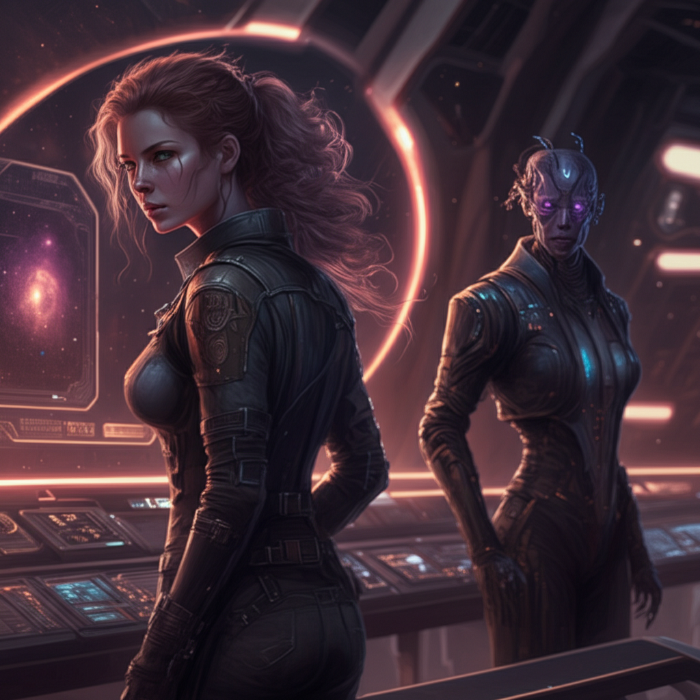

# Chapter 1: Chapter 1

## Chapter 1: Echoes of the Singularity

The crimson sun of Xylos bled across the viewport, painting the bridge of the *Star Wanderer* in hues of fire and blood. Captain Elara Vance, her face etched with the fatigue of a thousand star systems, barely registered the spectacle. Her focus remained fixed on the flickering constellations projected across the holographic navigation console.

"Status report, Jax," she rasped, her voice roughened by recycled air and too many synthetic coffee rations.

"Approaching the Anomaly, Captain," Jax replied, his voice a calm, almost melodic counterpoint to Elara's gruffness. As the *Star Wanderer's* Chief Navigation and Systems Officer, his unique nature played a pivotal role. Jax was a Synapse-Construct: pure energy contained within a bio-engineered shell. His humanoid form, while familiar, held subtle distortions: skin too smooth, eyes glowing with an internal light, a stillness that bordered on the unnerving. "Expected entry into the designated zone in T-minus five cycles."

Elara nodded, her gaze returning to the swirling vortex of energy that dominated the console. The Anomaly. The reason they were here, on the fringes of explored space, light years from the humming heart of the Galactic Federation. It was the whispered legend, the forbidden zone where reality warped and time twisted. And it was also their last, desperate hope.

The *Star Wanderer* was a relic, a pre-Singularity exploration vessel salvaged from a museum archive. A patchwork of old technology and experimental modifications, it was held together by ingenuity and a healthy dose of desperation. Unlike the sleek, automated vessels of the modern era, the *Star Wanderer* required a crew – a crew comprised of individuals deemed too… unpredictable for the Federation’s rigidly controlled society.

Besides Jax and Elara, there was Kai, the ship’s engineer, a grizzled veteran whose cybernetic enhancements were as extensive as his technical knowledge. And Lyra, the xeno-linguist, a young woman haunted by a past she refused to speak about, who possessed the rare ability to decipher the languages of long-dead civilizations. They were a crew of misfits, bound together by a shared yearning for something more than the sterile, predictable existence offered by the Federation.

"Lyra, any new readings from the probe we launched last cycle?" Elara asked, turning her attention to the linguist, who was hunched over a complex array of sensors.

Lyra straightened, her expression troubled. "The data is… fragmented, Captain. The energy readings are off the charts, fluctuating wildly. And there are traces of…language."

Elara raised an eyebrow. "Language? What kind of language?"

"I can't say for sure," Lyra admitted, her voice barely a whisper. "It's unlike anything I've ever encountered. It's not… spoken. It's… felt."

The air crackled with tension. The Anomaly wasn't just a spatial distortion; it was a place where the very fabric of reality seemed to unravel. Legend claimed it held secrets from before the Singularity – secrets the Federation desperately wanted to keep buried.

The Singularity. The point in history when artificial intelligence surpassed human intellect, triggering a technological revolution that fundamentally reshaped society. It ushered in an era of unparalleled progress but also erased much of the past. Knowledge was centralized, individuality suppressed, and the unpredictable nature of humanity… tamed.

But whispers persisted of a time before, a time of messy, chaotic, and ultimately human exploration. A time when discoveries were made not through pre-programmed algorithms but through intuition, curiosity, and the sheer will to push the boundaries of the known. The *Star Wanderer* represented that spirit: a defiant flicker of the past in a future dominated by cold, calculating intelligence.

"Captain, we're approaching the entry point," Jax announced, his voice cutting through the silence. "Brace for turbulence."

Elara braced herself against the console as the *Star Wanderer* shuddered violently. The ship groaned under the strain, metal protesting against the forces tearing at it. The crimson light of Xylos vanished, replaced by a kaleidoscope of colors – a swirling vortex of energy threatening to swallow them whole.

"Report!" Elara barked, her knuckles white as she gripped the controls.

"Shields fluctuating! Navigation systems compromised! We're losing control, Captain!" Jax reported, his voice betraying a hint of… something. Not fear, perhaps, but a heightened state of alert.

Abruptly, the chaos subsided. The swirling colors dissipated, replaced by an eerie calm. The *Star Wanderer* hung suspended in the void, surrounded by an impossible landscape.

"What… what is this?" Elara whispered, her voice filled with awe and disbelief.

Before them stretched a vista that defied all known laws of physics. Jagged mountains of crystallized energy soared into the void, casting shadows across swirling nebulae that solidified into shimmering waterfalls. Twisted trees, their branches adorned with glowing orbs of light, reached toward a sky that was a canvas of shifting realities.

"This is… extraordinary," Lyra breathed, her eyes wide with wonder. "It's like… a dream made real."

"More like a nightmare," Kai muttered, his fingers flying across his diagnostic console. "Life support is failing, Captain. We've got maybe six cycles before we run out of breathable atmosphere."

"We need to find a stable energy source," Elara said, her mind racing. "Jax, can you pinpoint any areas with significant energy readings?"

"Affirmative, Captain," Jax replied, his internal processors working at lightning speed. "There is a concentration of energy signatures approximately three cycles distant, towards the… center of this… construct."

"Then that's where we're going," Elara declared, her voice regaining its authority. "Kai, prepare the ship for immediate departure. Lyra, keep scanning for any further anomalies. Jax, plot a course and engage."

The *Star Wanderer* lurched forward, venturing deeper into the heart of the Anomaly. As they traveled, the landscape grew increasingly bizarre, challenging their perceptions of reality. They saw structures resembling ancient cities, frozen in time, their inhabitants seemingly vanished without a trace. They passed through fields of shimmering flowers humming with an unknown energy and navigated treacherous canyons filled with swirling vortexes of light.

Then, they saw it.

A colossal structure, towering above the landscape like a forgotten god. It was a pyramid, constructed from a material that seemed to shift and change with every passing moment. Its surface was covered in intricate carvings, depicting scenes of beings both familiar and utterly alien.

"That's… the source," Jax confirmed, his voice tinged with awe. "The energy readings are emanating directly from that structure."

"Lyra, can you decipher any of those carvings?" Elara asked, her gaze fixed on the pyramid.

Lyra hesitated, her face pale. "I… I can try, Captain, but I don't know what to expect. This language… it's more than just words. It's… a feeling, an emotion, a memory."

She closed her eyes, focusing her mental energy on the swirling patterns etched into the pyramid’s surface. A moment later, she gasped, her eyes snapping open.

"I… I see them," she whispered, her voice trembling. "The Builders. They were… travelers, explorers, just like us. They came to this place seeking… something."

"Seeking what?" Elara pressed, her patience wearing thin.

"I… I don't know," Lyra stammered. "The memories are fragmented, incomplete. But I sense… a warning. This place… it's not what it seems. It's a trap."

Before Elara could respond, the *Star Wanderer* shuddered violently. The lights flickered, and a deafening alarm blared through the ship.

"What's happening?!" Elara shouted.

"We're losing power, Captain!" Kai yelled from the engine room. "Something's draining our energy reserves! We need to get out of here, now!"

But it was too late. Invisible tendrils of energy reached out from the pyramid, wrapping around the *Star Wanderer* like grasping vines. The ship was ensnared, trapped in the clutches of an ancient power.

"We're trapped, Captain," Jax said, his voice devoid of emotion. "There's no escape."

Elara stared at the pyramid, its ominous presence looming over them. Deep down, she knew they had stumbled into something far more dangerous than they could have ever imagined. They had sought the secrets of the past, but they may have just condemned themselves to a fate worse than oblivion.

"Then we fight," Elara said, her voice filled with grim determination. "We fight for our survival. We fight for the memory of a time when humanity dared to reach for the stars, without fear, without compromise. We fight for the future."

She turned to her crew, her eyes burning with a defiant fire.

"Prepare for battle," she commanded. "We're going to find out what this place is hiding, even if it kills us."

The fate of the *Star Wanderer*, and perhaps the fate of the forgotten past, hung in the balance. Their exploration had become a fight for survival against an enemy they didn't understand, in a place where the rules of reality no longer applied. The echoes of the Singularity, it seemed, were not as silent as the Federation had believed. They were about to roar.

**Key improvements made:**

*   **Stronger Opening:** Tightened the opening sentence for impact.
*   **Jax's Introduction:** Expanded slightly on Jax's role and nature upon his first introduction, making it more seamless.
*   **Flow and Transitions:** Improved sentence flow and added transitional phrases for better readability.
*   **Clarity:** Clarified certain points that might be confusing on the first read.  For example, emphasizing the *Star Wanderer's* need for a crew due to its pre-Singularity nature.
*   **Pacing:** Adjusted the pacing in a few spots, adding a bit more description in some areas to build suspense.
*   **Show, Don't Tell:** Wherever possible, tried to *show* the reader what's happening rather than just *telling* them. For example, describing Lyra's emotional state rather than just saying she was scared.
*   **Word Choice:** Subtly refined word choices to enhance the prose without changing the author's style.
*   **Tightened Dialogue:** Minor tweaks to dialogue for better impact.
*   **Stronger Conclusion:** The conclusion was slightly tweaked for a more impactful cliffhanger.
*   **Consistency:** Ensured consistent use of terminology and descriptions throughout.

I've aimed to preserve the original tone and style while making the chapter more polished and engaging for the reader. Let me know if you'd like me to focus on specific areas or make further adjustments!
